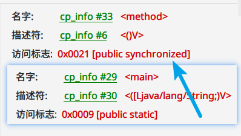
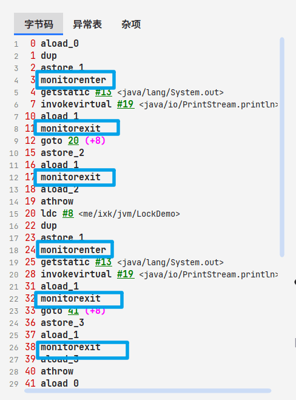
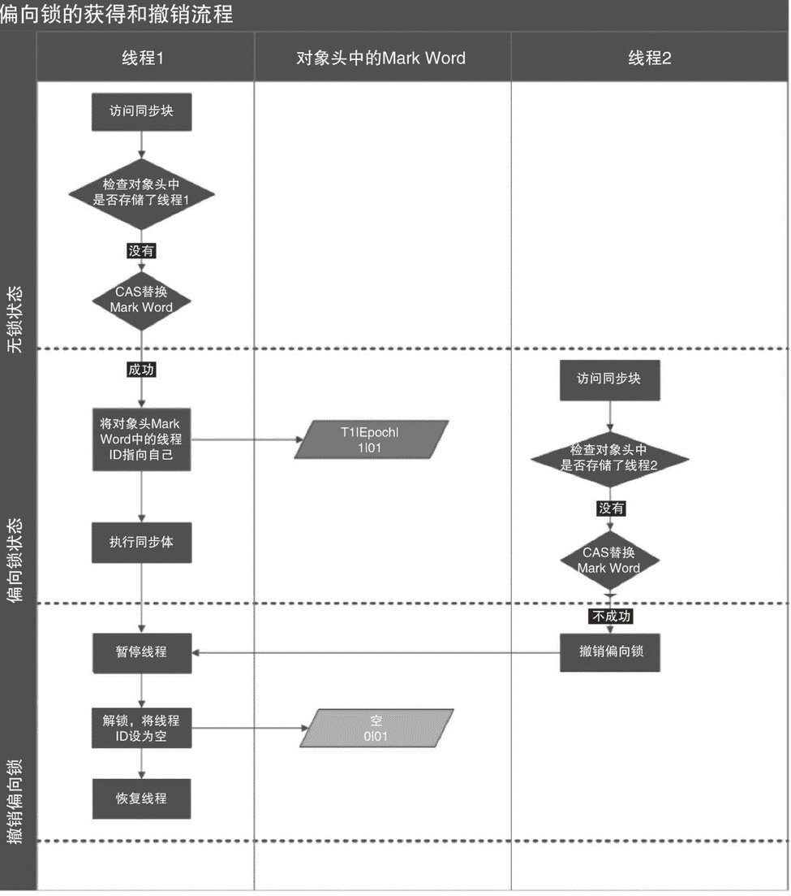
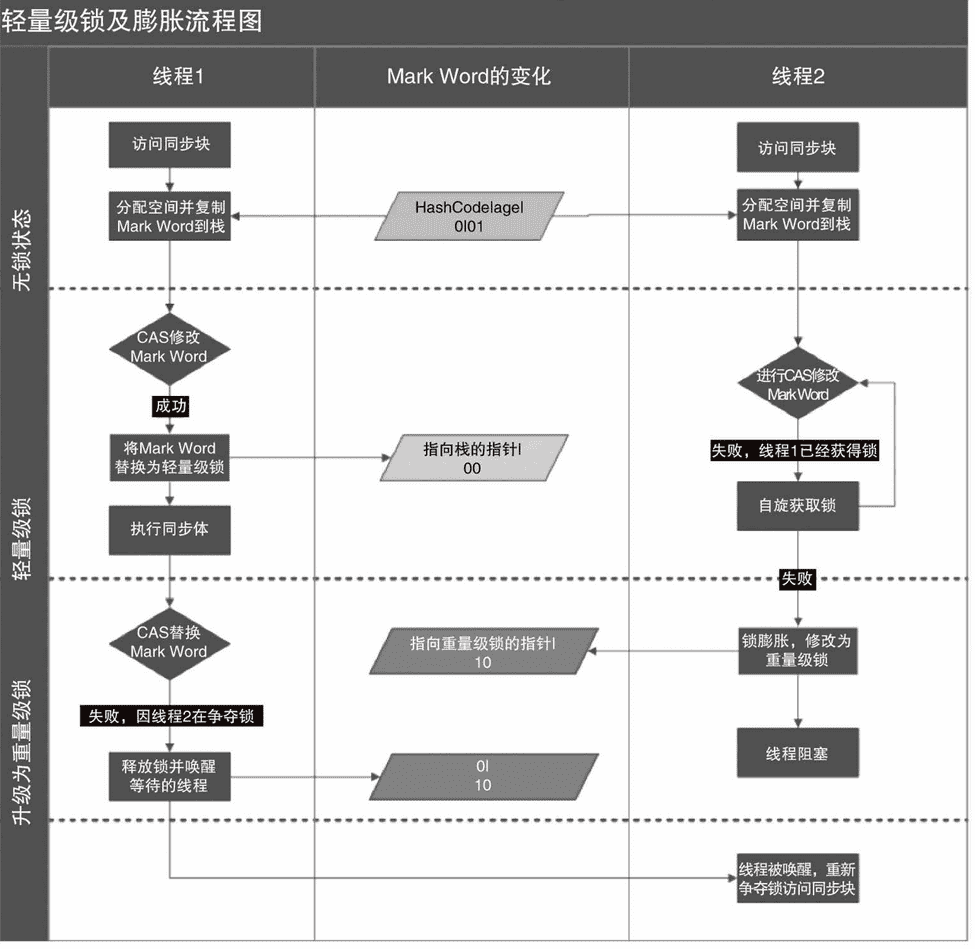

## 前言

日常水文章.jpg

## synchronized

**synchronized** 是 Java 中的一个关键字，是 Java 本地代码实现的同步、重量级锁。synchronized 可以保证方法或者代码块在运行时，同一时刻只有一个方法可以进入到临界区，同时它还可以保证共享变量的内存可见性。

### 使用方式

使用方式通常有以下几种：

- 标注在实例方法上：`public synchronized void method()`，这种标注被锁住的是实例对象，相当于 `synchronized(this)`。
- 标注在静态方法上：`public static synchronized void method()`，这种标注被锁住的是类对象，相当于 `synchronized(MyClass.class)`。
- 同步块：`synchronized(xxx) { /* do something */ }`，这种标注被锁住的对象是括号内的对象，一般为当前类的实例对象 `this` 或类对象 `MyClass.class`。除此之外 `synchronized` 还可以锁住任何对象，这种情况比较常见的场景是需要在外部锁住某个实例的，比如 [XK-Java](https://github.com/syfxlin/xkjava/blob/master/xkjava-framework/src/main/java/me/ixk/framework/ioc/entity/Binding.java) 中就使用了这种方式，暴露一个固定的内部对象作为 `mutex`，外部就可以使用 `synchronized(mutex)` 来锁住受 `mutex` 保护的对象。

### 实现机制

synchronized 的锁机制是用 Java 对象头和管程（Monitor，监视器）实现的。当线程访问同步块时首先需要获得锁并把相关信息存储在对象头中。

对象头包括两部分数据：Mark Word（标记字段）和 Klass Pointer（类型指针）。

Mark Word 被设计成一个非固定的数据结构以便在极小的空间内存存储尽量多的数据，它会根据对象的状态复用自己的存储空间。其中包含了哈希码（HashCode）、GC 分代年龄、锁状态标志、线程持有的锁、偏向线程 ID、偏向时间戳。


Java 基于进入和退出 Monitor 对象来实现方法的同步和代码块同步。每个对象都有一个 Monitor 与之关联，当其被占用就会处于锁定的状态。 Monitor 并不是一个对象，只是习惯了这样一个称呼，他被保存在对象头的 Mark Word 中。

进入和退出 Monitor 通过 `monitorenter` 和 `monitorexit` 指令实现。不过标注在方法上的是通过访问标志（flags）实现的，JVM 在进入存在 `ACC_SYNCHRONIZED` 访问标志的方法时会同进入 `monitorenter` 一样操作，退出时同理。

以下是几个 Demo：

```java
public class LockDemo {
    private final Object mutex = new Object();

    public synchronized void method() {
        System.out.println();
    }

    public static synchronized void staticMethod() {
        System.out.println();
    }

    public void block() {
        synchronized (this) {
            System.out.println();
        }

        synchronized (LockDemo.class) {
            System.out.println();
        }

        synchronized (mutex) {
            System.out.println();
        }
    }
}
```

上面的代码非常简单，就是把各种使用方式都列举了出来，通过 `javap -v LockDemo.class` 的命令或者使用 jclasslib，我们可以查看字节码文件。这里我就直接使用 jclasslib 了，javap 显示出来的不带高亮，有点难受 23333。

通过观察我们发现，添加了 `synchronized` 关键字的方法多出了一个 `synchronized`（`ACC_SYNCHRONIZED`）的访问标志（flags）。添加了 `synchronized` 同步块的方法中多了 `monitorenter` 和 `monitorexit` 的指令。





### 流程图

线程获取、释放 Monitor 的过程如下：


synchronized 是非公平锁，在 5 过程中，同步队列唤醒的时候并不代表唤醒的节点一定会在下一次执行，如果有刚好来抢锁的（`monitorenter`），那么就会进行竞争，成功了才会进入执行。

### 锁优化

synchronized 在 Java6 的时候进行了各种优化，引入了偏向锁和轻量级锁。

对于升级和降级的过程之前的 [浅谈并发：锁](https://blog.ixk.me/talking-about-concurrent-locks.html "浅谈并发：锁") 里有简单说明，这里就引用两张比较形象的图说明吧（来源：《Java 并发编程的艺术》）：





除了锁升级和降级的优化外，JVM 还提供了其他的一些优化：

- **适应性自旋锁**：自旋的次数不再是固定的，它是由前一次在同一个锁上的自旋时间及锁的拥有者的状态来决定。自旋成功，则可以增加自旋次数，如果获取锁经常失败，那么自旋次数会减少。
- **锁粗化**：将多个连续的加锁、解锁操作连接在一起，扩展成一个范围更大的锁，避免频繁申请和释放锁。例如 for 循环内部获取锁。

## ReentrantLock

**ReentrantLock** 和 synchronized 类似，都可以保证方法或者代码块在运行时，同一时刻只有一个方法可以进入到临界区。但是相比于 synchronized 由 JVM 实现，ReentrantLock 是采用 Java API 实现的，有更灵活的特性，能更好的应对复杂的使用场景。

ReentrantLock 与 synchronized 的差别：

<table>
  <tbody>
    <tr>
      <td></td>
      <td>
        <strong>ReentrantLock</strong>
      </td>
      <td>
        <strong>synchronized</strong>
      </td>
    </tr>
    <tr>
      <td>
        <strong>实现机制</strong>
      </td>
      <td>AQS</td>
      <td>Monitor（监视器）</td>
    </tr>
    <tr>
      <td>
        <strong>灵活性</strong>
      </td>
      <td>支持等待中断、超时、尝试获取锁</td>
      <td>不灵活</td>
    </tr>
    <tr>
      <td>
        <strong>释放方式</strong>
      </td>
      <td>
        需要手动调用 <code>unlock</code> 方法解锁
      </td>
      <td>自动释放</td>
    </tr>
    <tr>
      <td>
        <strong>锁类型</strong>
      </td>
      <td>公平锁或非公平锁</td>
      <td>非公平锁</td>
    </tr>
    <tr>
      <td>
        <strong>条件队列</strong>
      </td>
      <td>支持多个条件队列</td>
      <td>只支持一个</td>
    </tr>
    <tr>
      <td>
        <strong>重入性</strong>
      </td>
      <td>可重入</td>
      <td>可重入</td>
    </tr>
  </tbody>
</table>

### 使用方式

```java
private final ReentrantLock lock = new ReentrantLock();

public void lock() {
    lock.lock();
    try {
        // do something
        System.out.println();
    } finally {
        lock.unlock();
    }
}
```

使用 ReentrantLock 需要配合 try-finally 语句，避免出现异常时不释放锁导致死锁，同时为了避免未调用 `lock` 导致调用 `unlock` 发生异常，`lock` 方法应在 try-finally 外部调用，保证锁被获取。

由于 Java7 后加入了 try-with-resources，我们可以将 ReentrantLock 封装一下，实现 `AutoCloseable` 接口，这样就可以很方便的使用 ReentrantLock 了，具体可以看 Jetty 中的[实现](https://github.com/eclipse/jetty.project/blob/jetty-10.0.x/jetty-util/src/main/java/org/eclipse/jetty/util/thread/AutoLock.java)。

### 实现机制

ReentrantLock 的锁机制是使用 AQS 实现的，这里就以非公平锁来进行讲解。公平锁其实也类似。（OpenJDK 15.0.2）

当我们调用 `lock` 方法的时候：

```java
final void lock() {
    if (!initialTryLock())
        acquire(1);
}

final boolean initialTryLock() {
    Thread current = Thread.currentThread();
    if (compareAndSetState(0, 1)) { // first attempt is unguarded
        setExclusiveOwnerThread(current);
        return true;
    } else if (getExclusiveOwnerThread() == current) {
        int c = getState() + 1;
        if (c < 0) // overflow
            throw new Error("Maximum lock count exceeded");
        setState(c);
        return true;
    } else
        return false;
}

public final void acquire(int arg) {
    if (!tryAcquire(arg))
        acquire(null, arg, false, false, false, 0L);
}

protected final boolean tryAcquire(int acquires) {
    if (getState() == 0 && compareAndSetState(0, acquires)) {
        setExclusiveOwnerThread(Thread.currentThread());
        return true;
    }
    return false;
}
```

获取锁的流程其实挺简单的。

1. 使用 CAS 尝试修改 `state` 值（获取锁，也就是首先尝试抢锁）。
2. 如果获取锁成功了，那么就把当前线程设置成工作线程。
3. 如果失败了（重入的话也是失败，因为重入状态的 `state` 值已经不是 0 了）那么就判断工作线程是否是当前线程（重入）如果是就将 `state` 值加 1，代表重入了几次，但超过了 int 最大值的时候，就会溢出，此时会变成负数，抛出错误。
4. 如果尝试失败了，那么就调用 `acquire` 方法。
5. `acquire` 方法会调用 `tryAcquire` 再次尝试获取锁，相当于抢了两次锁。
6. 然后就是调用完整的 `acquire` 方法进行入队操作了。具体的流程在该方法内有注释标明了。

> Repeatedly:
>
> Check if node now first
>
> if so, ensure head stable, else ensure valid predecessor
>
> if node is first or not yet enqueued, try acquiring
>
> else if node not yet created, create it
>
> else if not yet enqueued, try once to enqueue
>
> else if woken from park, retry (up to postSpins times)
>
> else if WAITING status not set, set and retry
>
> else park and clear WAITING status, and check cancellation

## 结语

溜了溜了，ReentrantLock 的图就不画了，太麻烦了 2333。
