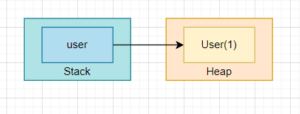
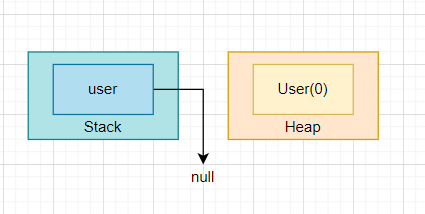
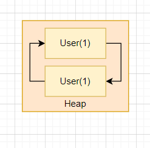
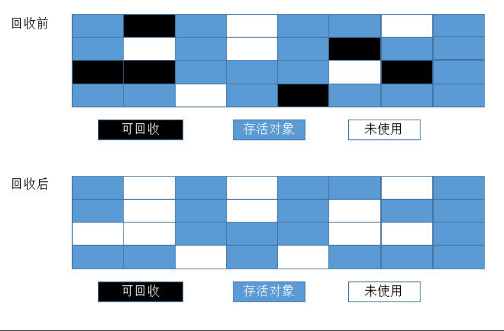
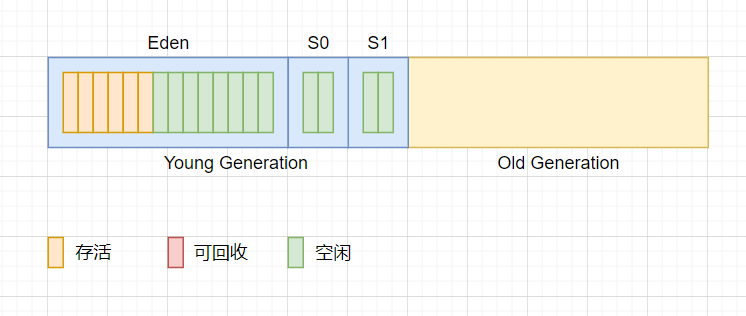
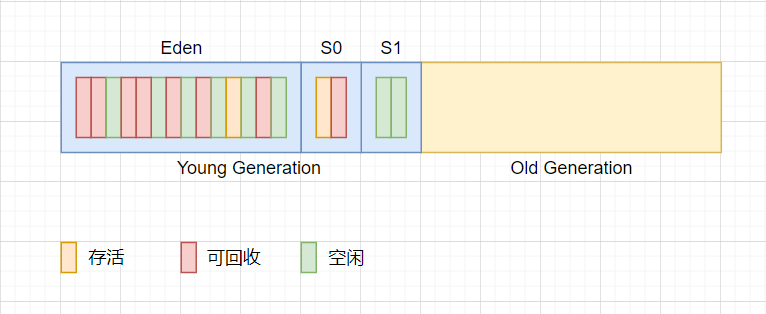
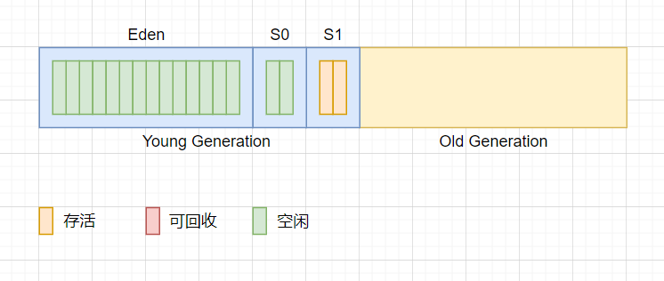
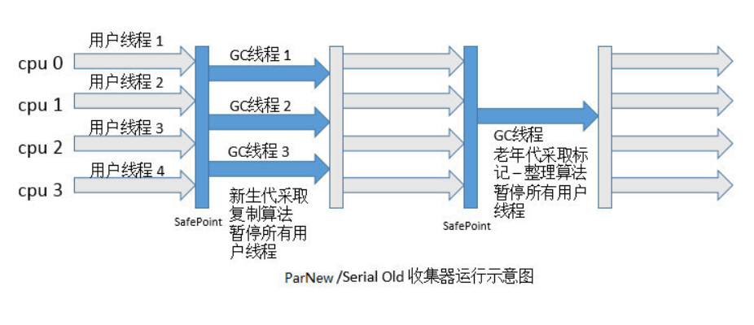
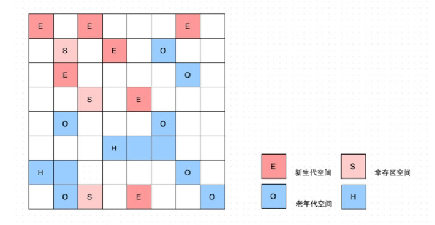

## 前言

又是一篇计划了很久的文章，7 月初就打算写了，一直拖到了现在。前不久更新了一波博客，把博客的数据源换成了 CMS，趁机试试看好不好用。🤣

## 什么是垃圾回收？

**垃圾回收（Garbage Collection，GC）**，顾名思义就是释放垃圾占用的空间。垃圾即无用的内存，垃圾回收的目的就是将这些无用的内存从 JVM 中释放掉，将空间让给其他代码使用。

初学 Java 的时候我们一定都听过 Java 是可以自动进行内存管理的，不需要编写析构代码。在 Java 中是使用自动垃圾回收的方式来释放无用的内存，大部分能自动管理内存的语言都是使用了这种方式，不过也有例外，比如 Rust。

## JVM 内存区域

在了解 GC 前肯定是需要先了解 JVM 有那些区域，得先知道哪些内存需要回收，哪些不需要。

在 JVM 中分为以下几个区域：（以 Java 8 为例，7 就不写了）

- **堆**：堆是 Java 对象存放的 主要区域 （因为 JVM 发展至今栈上分配、标量替换优化技术将会导致一些微妙的变化发生），同时也是 GC 垃圾回收器管理的主要区域。一般有 新生代 和 老生代 的划分（部分垃圾回收器没有划分）。
- **元空间**：元空间存放类和方法等元数据和 运行时常量池。在 Java 8 后元空间替换掉了以前的方法区和永久代。
- **Java 虚拟机栈**：用于存放 Java 方法运行时的栈帧，栈帧分为局部变量表、操作栈、动态链接和方法返回地址。每个线程都有其独立的 Java 虚拟机栈。
- **本地方法栈**：和 Java 虚拟机栈类似，用于存放本地原生方法运行时的栈帧。
- **程序计数器**：存储当前执行语句的索引。可以认为是代码行号指示器。字节码解释器⼯作时通过改变这个计数器的值来选取下⼀条需要执⾏的字节码指令，分⽀、循环、跳转、异常处理、线程恢复等功能都需要依赖这个计数器来完成。每个线程都有其独立的程序计数器。
- **直接内存**：直接内存又称为堆外内存，是 JVM 直接分配使用操作系统的内存。不受堆大小的限制，同时也能提高性能，避免了原生堆和 Java 堆来回复制数据的损耗。

在 JVM 中只有程序计数器的区域不会抛出 `OutOfMemoryError` 错误。


## 什么是垃圾？

既然是要进行垃圾回收，那么 JVM 又是怎么判断那些是无用的垃圾呢？这里就要用到垃圾识别机制了。

垃圾识别机制用于判断对象是否存活，若已经死亡则可以被垃圾回收器回收。常见的垃圾识别机制有以下两种。

### 引用计数算法

**引用计数算法（Reachability Counting）** 即给那个对象添加一个引用计数器，每当有其他的对象引用了这个对象，就把引用计数器的值+1，如果一个对象的引用计数为 0 则说明没有对象引用它，此时就可以回收该对象。

比如我们创建了一个 User 对象，此时 JVM 就会在堆中分配一份内存，同时将该对象的计数改为 1。



当程序走出了 `user` 的作用域访问的时候，或者将 `user` 设为 `null`，这时候堆中 User 对象的计数就变成 0 了，此时就可以对该对象进行回收了。



此种垃圾识别机制非常高效，原理简单，并且不需要 **Stop-The-World**。但是对于主流的 Java 虚拟机都没有使用这种识别机制。这是因为有非常多的例外需要考虑，比如循环引用的情况，此时计数就会有问题。如以下的例子，两个 User 对象互相引用对方，此时两者的引用计数都不为 0，所以垃圾回收器并不能回收这些内存。



### 可达性分析算法

**可达性分析算法（Reachability Analysis）** 即通过一些被称为 GC 根（GC Root）的对象作为起点，向下进行搜索。整个搜索经过的对象组成了一条引用链，在引用链上的对象被称为可达的，而在引用链外的对象称为不可达，游离于 GC Roots 之外，此时这些对象就可以被回收了。


可以作为 GC Root 的对象包括如下：

- 栈帧中的变量（包括参数、局部变量、临时变量等等）所引用的对象。
- 本地方法栈所引用的对象。
- 静态属性引用的对象、常量等。
- JVM 内部引用的对象，如类加载器等。
- 等等

虽然可达性分析算法解决了循环依赖的问题，但是也产生了许多新的问题。进行可达性分析（搜索）的过程是需要时间的，而此时程序也是在并行运行着，不断产生新的对象，丢弃无用的对象。整个内存的状态是在变化的，所以目前主流的垃圾回收算法大多都要进行一种操作 **Stop-The-World**，翻译过来即停止世界，即暂停所有的用户线程，避免内存堆的状态发生变化。

## 怎么回收垃圾？

在前面我们已经识别了可以被回收的垃圾，那么应该如何回收呢？此时就要用到垃圾回收的算法了，垃圾回收算法按操作的形式分为了三种，分别是标记-清除、标记-复制、标记-整理三种。不同的垃圾回收算法都有其优缺点，不存在银弹，具体需要按场景进行选择。

### 标记-清除

标记清除算法的流程分成两个阶段，其中标记阶段即找出哪些内存是垃圾可以被回收，清除阶段即对标记过的
内存进行回收操作，其回收前后的对比图如下：



从图中我们可以很清楚的看到其回收过程就是简单的把无用的内存区块进行清除，这样就会产生大量的内存碎片。虽然总体看起来还有足够的剩余内存空间，但是都是以一块很小的内存分散到各个地方。如果此时需要为一个大对象申请空间，那么即使总体上的内存空间足够，但是 JVM 无法找到一块足够大的连续内存空间时也会触发一次 GC。

### 标记-复制

为了避免出现内存碎片，演化出了标记复制算法，标记复制算法将完整的内存区域划分成两份大小相同的子区域，分别为运行区域和预留区域。当有新的对象被创建的时候，JVM 会将这些对象全部分配到内存区域，当运行区域满了的时候，就将运行区域还存活的对象全部复制到预留区域，然后将整个运行区域清空，最后交换运行区域和预留区域的职责，即此时的预留区域就变成了运行区域，而被清空的运行区域则变成预留区域。其回收前后的对比图如下：


图中就很好的说明了整个回收过程，标记复制算法可以解决内存碎片的问题，但是浪费了一半的空间，在内存还不便宜的当下，多浪费了一点空间就相当于多浪费了钱。同时当每次内存不够，又垃圾很少的情况下，为了释放出足够的内存通常需要好几轮的 GC，而复制操作又是极其昂贵的，留着一半的内存没法使用，显然不是很好的方式。

### 标记-整理

标记复制算法会浪费一半的空间，为了充分利用完整的空间，同时避免产生内存碎片，于是就有一种新的方式被提出来。当标记过程完成后，就将存活的对象向内存的一端移动，最后清理掉存活对象边界以外的空间。其回收前后的对比图如下：


虽然标记整理的算法解决了内存碎片和空间浪费的问题，但也不是完美的，如果存活的对象非常分散，则需要移动大量的对象来达到整理的目的。

## 堆的分区

堆（Heap）时 JVM 垃圾收集器主要光顾的区域，也是 JVM 所管理内存中最大的一块。为了更好的管理堆，JVM 将堆分成了 2 个区域：新生代（Young Generation）、老生代（Old Generation），占比一般是 1：2。其中新生代又划分了 3 三个区域：Eden、Survivor From、Survivor To，占比一般为 8：1：1。


### 为什么要分区？

可以看到 JVM 为堆分成了许多个区域，那么为什么要分成这么多个区域呢？之所以这么划分是因为，大部分的对象都是非常短命的，创建不久后就不再使用了，比如方法内的临时变量。而存活了越久的对象则难以消亡，当然这里的难以消亡并不是难以清除，而是活的越久的对象，通常情况下都是在使用的，不会被清理，比如类的字段、静态变量引用的对象、单例等等，都是常驻于内存的。

既然内存的特性是这样的，那么那些长命的对象就不用经常的去判断它是否是垃圾，在内存满的时候自然也会优先的清理那些短命的对象，这样将两者分成两个区域显然更易于管理。

既然分了新生代、老生代那么为什么还要对新生代进行划分呢？这是因为如果每进行一次 Young GC（具体下文会说明）就将存活对象移到老生代，那么老生代很快就会被填满，而这些对象实际上并不一定是长命的，可能只是刚好在使用。为了解决这个问题，就需要再进行分区，筛选出真正长命的对象，这些对象才能被送到老年代。

那么为什么需要两个 Survivor 区呢？我们在上面的垃圾回收的小节有提过标记-复制的算法，分成两个 Survivor 区就如同这个算法一样，为了避免产生内存碎片，可以想象新生代的对象变化很快，很容易就产生了大量的内存碎片。分成两个区后，在整个筛选的过程中，永远有一个 Survivor 区是空的，一个是无碎片的。另外不分成更多个的原因也很简单，避免浪费内存，同样也使每个 Survivor 区足够大，减少复制的次数。

### 新生代

上面的小节其实就把整个新生代的情况说明的差不多了，这里就随便写下 2333。

- **Eden 区**：该区域是新建 Java 对象的主要区域（有例外，后续会说明），绝大多数对象都是短命的，所以也是垃圾收集器最常光顾的区域，大多数 GC 都发生在这个区域，同时由于新生代的区域本身较小，GC 速度也较快。
- **Survivor 区**：该区域划分为 From 和 To 两个区域，存放着 Eden 区经过 GC 后存活的对象，一个区域始终为空，另一个始终没有内存碎片。是为了筛选长命对象而存在的，当有对象放不下的时候会直接进入老生代。

### 老生代

老生代是堆中最大的一块区域，里面存放了存活时间较长的对象，GC 频率相比新生代低很多。相对于新生代较为稳定。

## 垃圾回收的分类

在了解 Java GC 的时候，我们通常会听到很多种 GC，像 Minor GC、Major GC、Full GC 等等，数量太多了，实际上 GC 并不是一成不变的，不同的垃圾回收器有不同的 GC 分类和回收方式。通常情况下我们会简单的划分成以下的分类：

- **Partial GC**：部分 GC 即只对部分区域进行垃圾回收，通常也按区域细分成以下几种。
  - **Young GC**：只收集新生代。常说的 Minor GC 一般指的就是 Young GC。
  - **Old GC**：只收集老生代。只有 CMS 存在这个模式。
  - **Mixed GC**：收集新生代和老生代。只有 G1 存在这个模式。
- **Full GC**：即收集整个内存区域，包括新生代、老生代、元空间等。常说的 Major GC 一般指 Full GC，但是也有些人将 Old GC 称为 Major GC。

## 垃圾回收的过程

先谈下 GC 的过程吧，垃圾回收器就放后面一点吧。

### 新生代垃圾回收

那么我们就以程序刚运行开始，首先我们知道 JVM 会将新对象分配到 Eden 区，Eden 不断的分配新的空间给程序使用，此时由于 Eden 区还未满，所以 Survivor From 区（下称 S0）、Survivor To 区（下称 S1）以及老年代都还未被使用，状态如下图所示：



当程序运行一段时间后，Eden 区逐渐被使用满，同时部分对象也已经可以回收，状态如下图所示：


此时如果需要程序要求 JVM 为其分配一个 2 单位的连续空间，可以看到 Eden 只剩下一个单位的连续空间了，这时候为了能分配成功，JVM 会执行一次 Young GC（为了避免产生歧义这里都使用按区域划分的 GC 分类），Eden 的存活对象会移动到 S0，同时可回收的对象的空间也会被回收，状态如下图所示：


此时 Eden 区就有足够的空间分配新的对象了，但是经过一段时间的使用后，Eden 区又不够分配了，这时候就要执行第二次 Young GC 了，假设之前移动到 S0 的 2 单位对象有 1 单位已经变为可回收，那么此时存活的对象会移动到 S1，同时 S0 也会整个被清空，如下图所示：





### 新生代晋升老生代

新生代的空间终究是有限的，当对象符合了晋升的条件就可以将其移动到老生代，释放新生代的内存空间。晋升条件一般有以下四种：

- **分配担保机制** ：当新生代的区域满时，会进行 Young GC，若 GC 后依然无法存入对象，则将一些年龄较大（经过一次 GC 年龄 +1）的对象提前移入老生代，让出新生代的空间。
- **对象过大** ：新生代的空间一般比老生代小，当有一个巨大的对象要创建的时候，新生代无法存入，则会直接在老生代分配。通常为了避免在 Eden 区、Survivor 区复制，即使新生代有足够的空间，JVM 也会直接将对象分配到老生代。
- **长期存活对象** ：新的肯定会变成老的，当年龄达到一定岁数就移入老生代，默认为 15。
- **动态对象年龄判定** ：如果在 Survivor 区中相同年龄的对象的所有大小之和超过 Survivor 空间的一半，年龄大于或等于该年龄的对象就可以直接进入老年代。

## 垃圾回收器

垃圾回收器就简单介绍下吧，详细可以自行搜索。

### Serial && Serial Old

- **Serial**，用于新生代，采用标记-复制算法，回收时采用单线程的方式，进行垃圾收集的时候需要暂停其他线程（STW）。 一般用于 Client 端的 JVM。
- **Serial Old**，用于老生代，采用标记-整理标记整理算法，回收时采用单线程的方式。进行垃圾收集的时候需要暂停其他线程（STW）。


### ParNew

ParNew，用于新生代，采用标记-复制算法，回收时采用多线程的方式，进行垃圾收集的时候会暂停其他线程。



### Parallel Scavenge & Parallel Old

- **Parallel Scavenge**，用于新生代，采用标记-复制算法，回收时采用多线程的方式，进行垃圾收集时会暂停其他线程。重视吞吐量。
- **Parallel Old**，用于老生代，采用标记-整理标记-整理算法，回收时采用多线程方式，进行垃圾收集时会暂停其他线程。重视吞吐量。


### CMS（Concurrent Mark Sweep）

CMS，用于老生代，采用标记-清除算法，回收时混合使用单/多线程，标记时需要暂停其他线程，清除时不需要暂停其他线程。注重最低的 STW。

回收步骤：

1. **并发标记**：进行 GC Roots 跟踪的过程，耗时最长，不过无需 STW。
2. **初始标记**：标记一下 GC Roots 能直接关联到的对象，需要 STW，速度很快。
3. **重新标记**：暂停其他线程（STW），不过可以并发处理，修正并发标记期间因其他线程续运作而导致标记产生变动。速度较快。
4. **并发清除**：实际进行内存清理，无需 STW。


### G1

G1，可同时用于新生代和老生代，整体上看采用标记-整理算法，局部上看采用标记-复制算法。当今收集器技术发展最前沿的成果之一，实现高吞吐的同时，尽可能的减少 STW 的时间。

回收步骤：

1. **初始标记**：标记一下 GC Roots 能直接关联到的对象，需要 STW，速度很快。
2. **并发标记**：进行 GC Roots 跟踪的过程，耗时最长，不过无需 STW。
3. **最终标记**：暂停其他线程（STW），不过可以并发处理，修正并发标记期间因其他线程续运作而导致标记产生变动。速度较快。
4. **筛选回收**：首先对各个 Region 中的回收价值和成本进行排序，根据用户所期望的 GC 停顿是时间来制定回收计划。此阶段其实也可以做到与用户程序一起并发执行，但是因为只回收一部分 Region，时间是用户可控制的，而且停顿用户线程将大幅度提高收集效率。



### ZGC

ZGC 是 JDK11 新推出的一款低延迟垃圾回收器，和 G1 类似，ZGC 也采用了标记-复制算法，同样也对堆进行 Region 划分，ZGC 在标记、转移和重定位阶段几乎都是并发的，这是 ZGC 实现停顿时间小于 10ms 目标的最关键原因。ZGC 的 STW 只依赖于 GC Roots，停顿时间不会随着堆的大小或者活跃对象的大小而增加。

回收步骤：

1. **初始标记**：与 G1 一样，都是标记下 GC Roots 能关联到的对象，需要 STW，同样速度也很快。
2. **并发标记**：与 G1 一样，并发标记都是做可达性分析。是并发的。
3. **最终标记**：与 G1 一样，都是修正并发标记期间因线程继续运行导致的标记变动。
4. **并发预备重分配**：这个阶段需要根据特定的查询条件统计得出本次收集过程要清理哪些 Region，将这些 Region 组成重分配集。ZGC 每次回收都会扫描所有的 Region，用范围更大的扫描成本换取省去 G1 中记忆集的维护成本。
5. **并发重分配**：在上面的阶段过后，ZGC 就会将重分配集里存活的对象复制到新的 Region 上。


ZGC 通过读屏障和着色指针，解决转移过程中准确访问对象的问题，做到了并发转移。由于在并发 GC 中，应用程序也在不断的访问对象修改对象，而一旦 GC 变更了某个对象的地址，那么应用线程很可能就会读到旧地址，导致异常。而 ZGC 中，应用程序在读取对象时会触发读屏障，若对象被移动了，那么读屏障会把获取到的指针更新到对象的新地址上，而判断对象的地址是否更改的方式则是着色指针。

## 引用

最后再讲讲引用相关的东西吧，无论那种垃圾识别机制都离不开引用的分析和判断，在 Java 中有以下 4 种引用：

### 强引用

当我们 new 一个对象的时候并赋值到一个变量中的时候，此时该对象就拥有了强引用。只要有一个强引用还指向一个对象，垃圾回收器就不会收集该对象，当内存不足的时候 JVM 也不会回收强引用的对象，而是会抛出 OOM 错误。超过了引用的作用域，或者显示的设为 null 则不再是强引用。

```java
class Main {
  public static void main(String[] args) {
    // 强引用
    Object object = new Object();
  }
  // 脱离 main 方法作用域的时候就不再是强引用了
}
```

### 软引用

软引用通过 `SoftReference` 类实现。可以让对象豁免一些垃圾收集，当 JVM 认为内存不足的时候就会回收这些引用指向的对象，即在抛出 OOM 前，JVM 会试图清除软引用的对象。软引用常用于实现内存敏感的缓存，如果还有空闲内存，就可以暂时保留缓存，当内存不足时清理掉，这样就保证了使用缓存的同时，不会耗尽内存。

```java
class Main {
  public static void main(String[] args) {
    // 软引用
    SoftReference<Object> object = new SoftReference<>(new Object());
    // 重新恢复强引用
    if (object.get() != null) {
      final Object o = object.get();
    }
  }
}
```

### 弱引用

弱引用通过 `WeakReference` 实现。不能豁免垃圾收集，仅提供了一种访问对象的途径。当 GC 扫描到弱引用的时候就会直接清除弱引用指向的对象。弱引用可以用来构建一种没有特定约束的关系，如实例缓存，当能获取到缓存时则使用，不能访问到的时候则重新实例化。

```java
class Main {
  public static void main(String[] args) {
    // 弱引用
    WeakReference<Object> object = new WeakReference<>(new Object());
    // 重置到强引用
    if (object.get() != null) {
      final Object o = object.get();
    }
  }
}
```

### 虚引用（幻象引用）

幻象引用通过 `PhantomReference` 类实现。幻象引用的对象不能被访问到，幻象引用仅仅是提供了一种确保对象被 `finalize` 以后，做某些事情的机制。如果一个对象仅持有虚引用，那么它就和没有任何引用一样，在任何时候都可能被垃圾回收器回收。幻象引用需要配合引用队列使用。

## 结语

写篇文章不容易呀，不过看书最近实在看不下去，还是写文章的效率高点。溜了溜了，最近秋招也开始了，感觉投了也是石沉大海。😥

## 引用

- [咱们从头到尾说一次 Java 垃圾回收 | InfoQ](https://www.infoq.cn/article/zoyqri4c-bfkmubmzmkn)
- [图解 Java 垃圾回收算法及详细过程！| InfoQ](https://xie.infoq.cn/article/9d4830f6c0c1e2df0753f9858)
- [Major GC 和 Full GC 的区别是什么？触发条件呢？| 知乎](https://www.zhihu.com/question/41922036)
- [新一代垃圾回收器 ZGC 的探索与实践 | 美团技术团队](https://tech.meituan.com/2020/08/06/new-zgc-practice-in-meituan.html)
