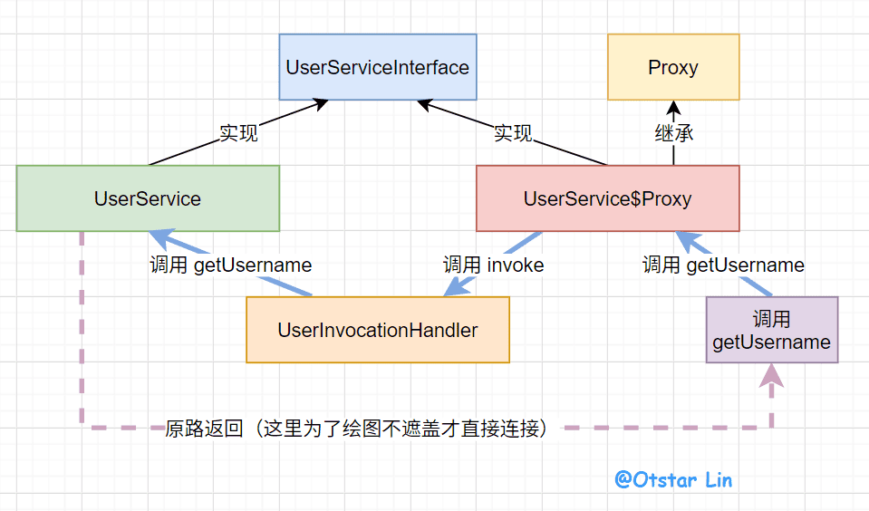
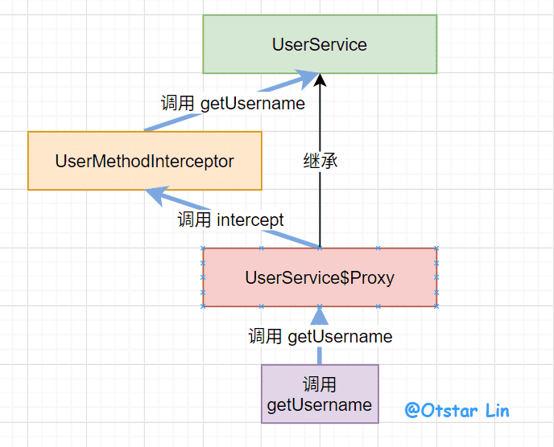

## 前言

好久没写浅谈系列的文章了，正好最近正在整理 Aop 相关的资料，之前也写过 DI 和 IoC 的文章，想想还是直接写一篇文章输出下。

> 寫文的好處嘛，就是一堆你以為已經懂的東西，結果根本是一知半解。 - [来源](https://twitter.com/kurotanshi/status/1284786796216250368)

## 什么是 Proxy？

在讲 Aop 之前还是需要先讲讲 Proxy。

**Proxy (代理)** 是实现 **Aop (切面)** 的基础，使用代理方法我们可以在不修改原始类的情况下增加一些功能，这个行为一般称之为装饰，不过和装饰模式不同的是装饰模式是动态的装饰原始类，可以通过切换不同的装饰器做到不同的效果，在 Java 中，常见的代理有三种：

- 静态代理：使用代理模式实现
- Jdk 代理：使用 Jdk 中内置的 Proxy 类实现，基于接口
- Cglib 代理：使用 Cglib 动态生成代理类，基于子类

### 静态代理

静态代理采用的是在代码中写好代理类的方式实现，通常使用代理模式这个设计模式规范设计，由于需要手写代理类，所以当被代理类很多的时候，那么要跟着写很多代理类，所以一般只用于对性能敏感等需要代理少量类的场景下。

### Jdk 代理

Jdk 代理是一种动态代理，动态代理的好处是不需要我们手写代理类。在 Jdk 中有一个 `Proxy` 类我们可以通过使用这个类的 `newProxyInstanc`e 动态的创建一个代理类，我们只需要实现 `InvocationHandler`，就可以做到被代理类的装饰。

#### 例子

要使用 Jdk 代理需要先准备三样代码：被代理类，被代理类实现的接口，实现 `InvocationHandler` 的装饰类

首先是被代理类的接口（`UserServiceInterface`）：

```java
public interface UserServiceInterface {
  String getUsername();
}
```

然后是被代理类（`UserService`）：

```java
public class UserService implements UserServiceInterface {

  @Override
  public String getUsername() {
    System.out.println("执行被代理方法中");
    return "syfxlin";
  }
}
```

由于 Jdk 代理是基于接口的，所以最少需要实现一个接口

最后是实现 `InvocationHandler` 的装饰类：

```java
import java.lang.reflect.InvocationHandler;
import java.lang.reflect.Method;

public class UserInvocationHandler implements InvocationHandler {
  final UserServiceInterface userService;

  public UserInvocationHandler(UserServiceInterface userService) {
    this.userService = userService;
  }

  @Override
  public Object invoke(Object proxy, Method method, Object[] args)
    throws Throwable {
    System.out.println("执行被代理方法前");
    Object result = method.invoke(this.userService, args);
    System.out.println("执行被代理方法后");
    System.out.println("返回值: " + result);
    return result;
  }
}
```

执行的方法：

```java
import java.lang.reflect.Proxy;

public class Main {

  public static void main(final String[] args) {
    UserService userService = new UserService();
    UserServiceInterface proxyInstance = (UserServiceInterface) Proxy.newProxyInstance(
      Main.class.getClassLoader(),
      UserService.class.getInterfaces(),
      new UserInvocationHandler(userService)
    );
    System.out.println(proxyInstance.getUsername());
  }
}
```

代码很简单，这里就不解释了，我直接贴结果吧：

- 执行被代理方法前
- 执行被代理方法中
- 执行被代理方法后
- 返回值: syfxlin
- syfxlin

可以看到，我们通过装饰类 “偷偷” 在方法前和方法后插入了一些代码，生成的代理类的工作是 Jdk 动态完成的。

#### 原理

当我们调用 `Proxy.newProxyInstance` 的时候 Jdk 会调用 `ProxyGenerator` 的 `generateProxyClass` 方法，该方法返回 `byte` 数组，这就是动态生成的代理类，我们可以把 `byte` 输出成 `class` 文件，然后使用 Intellij IDEA 反编译查看该类。

下面是生成代理类 `class` 文件的代码：

```java
import java.io.File;
import java.io.FileOutputStream;
import java.lang.reflect.Method;
import java.lang.reflect.Modifier;
import java.util.List;

public class Generator {

  public static void main(final String[] args) throws Exception {
    final Class<?> proxyGeneratorClass = Class.forName(
      "java.lang.reflect.ProxyGenerator"
    );
    final Method generateProxyClass = proxyGeneratorClass.getDeclaredMethod(
      "generateProxyClass",
      ClassLoader.class,
      String.class,
      List.class,
      int.class
    );
    generateProxyClass.setAccessible(true);
    byte[] classBytes = (byte[]) generateProxyClass.invoke(
      null,
      Generator.class.getClassLoader(),
      UserService.class.getName(),
      List.of(UserService.class.getInterfaces()),
      Modifier.PUBLIC
    );
    File file = new File("UserService.class");
    FileOutputStream fileOutputStream = new FileOutputStream(file);
    fileOutputStream.write(classBytes);
    fileOutputStream.flush();
    fileOutputStream.close();
  }
}
```

反编译的代码这里就不全放了，我只放关键的部分：

```java
public class UserService extends Proxy implements UserServiceInterface {
    // ...

    public final String getUsername() {
        try {
            return (String)super.h.invoke(this, m3, (Object[])null);
        } catch (RuntimeException | Error var2) {
            throw var2;
        } catch (Throwable var3) {
            throw new UndeclaredThrowableException(var3);
        }
    }

    // ...
}
```

从反编译的类中我们可以看出代理的类实现了 `Proxy` 类，同时继承了我们定义的 `UserServiceInterface` 接口，并实现了该方法，这也是 Jdk 代理只能代理有接口的类的原因。

然后是 `getUsername` 方法，代理类通过调用在父类定义的 `InvocationHandler` 中的 invoke 方法来执行具体的代码。

到这里我们梳理下流程吧：



Jdk 代理在 Jdk 中的很多地方都有用到，其中最典型就是注解，我们使用的注解其实是通过 Jdk 动态代理的方式创建对应的注解类，而注解中的属性（方法）其实并不是真实的方法返回值，而是通过动态代理从代理类中的一个隐藏 `Map` 属性 `memberValues` 中获取的，操纵了这个 `Map` 的值，相应方法的返回值也会跟着改变，通过这个特性我们就可以制作出同 Spring 一样的注解别名了。

### Cglib 代理

Cglib 也是一种动态代理，功能和 Jdk 代理类似，不过 Cglib 使用的是继承被代理类的方式装饰被代理类，所以可以代理无接口的类。

#### 例子

要使用 Cglib 代理，我们首先需要准备 Cglib，被代理类（`UserService`），实现了 `MethodInterceptor` 的装饰类：

Cglib 的导入这里就不写了，导入的方式有很多种，只要导入了就行了。

然后是实现了 `MethodInterceptor` 的装饰类：

```java
import java.lang.reflect.Method;
import net.sf.cglib.proxy.MethodInterceptor;
import net.sf.cglib.proxy.MethodProxy;

public class UserMethodInterceptor implements MethodInterceptor {
  UserService userService;

  public UserMethodInterceptor(UserService userService) {
    this.userService = userService;
  }

  @Override
  public Object intercept(
    Object obj,
    Method method,
    Object[] args,
    MethodProxy proxy
  )
    throws Throwable {
    System.out.println("执行被代理方法前");
    Object result = proxy.invoke(this.userService, args);
    System.out.println("执行被代理方法后");
    System.out.println("返回值: " + result);
    return result;
  }
}
```

执行的方法：

```java
import net.sf.cglib.proxy.Enhancer;

public class Cglib {

  public static void main(final String[] args) {
    final UserService userService = new UserService();
    UserService proxyInstance = (UserService) Enhancer.create(
      UserService.class,
      UserService.class.getInterfaces(),
      new UserMethodInterceptor(userService)
    );
    System.out.println(proxyInstance.getUsername());
  }
}
```

代码也很简单，输出和 Jdk 动态代理的一样，这里就不细讲了。

#### 原理

要生成 Cglib 代理类的 `class` 只需要设置一下系统的属性就可以了：

```java
System.setProperty(
      DebuggingClassWriter.DEBUG_LOCATION_PROPERTY,
      System.getProperty("user.dir") + File.separator + "target"
    );
```

下面是生成代理类 `class` 文件的代码，同样删掉一些不需要关注的代码：

```java
public class UserService$$EnhancerByCGLIB$$a8aec49d extends UserService implements UserServiceInterface, Factory {
    // ...

    final String CGLIB$getUsername$0() {
        return super.getUsername();
    }

    public final String getUsername() {
        MethodInterceptor var10000 = this.CGLIB$CALLBACK_0;
        if (var10000 == null) {
            CGLIB$BIND_CALLBACKS(this);
            var10000 = this.CGLIB$CALLBACK_0;
        }

        return var10000 != null ? (String)var10000.intercept(this, CGLIB$getUsername$0$Method, CGLIB$emptyArgs, CGLIB$getUsername$0$Proxy) : super.getUsername();
    }

    // ...
}
```

通过上面的代码我们可以看到，代理类继承了我们的 `UserService` 类，同时实现了一些接口，`UserServiceInterface` 是我们手动传入的，如果不传入就不会出现在代理类中，不过由继承自 `UserService` 类，所以其实代理类也是实现了 `UserServiceInterface` 接口。

Cglib 代理的流程其实和 Jdk 代理差不多，也是转发到一个装饰器，然后通过这个装饰器来动态的增加一些功能。

Cglib 代理具体流程：



## 什么是 Aop？

如果你看过之前写过的关于中间件的[文章](https://blog.ixk.me/middleware-implementation-with-php.html)，想必你已经知道 **Aop (面向切面编程)** 的作用和使用场景了，不过为了照顾到不清楚 Aop 的同学们，我还是稍微介绍下吧。

Aop 是一种设计范型，旨在将复用的逻辑抽离出来，这么说可能难以理解，我们就举个例子吧，假设我们今天要实现一个 API 鉴权的功能，如果不使用 Aop，我们为了每个 API 都能有权限验证，那么我们需要给每个 API 都增加相应的鉴权代码，这是非常丑陋的，那么我们要如何优化呢？把复用的逻辑抽出来，再进入每个 API 的业务之前对请求鉴权，而这就是 Aop 的思想和功能。

### 一些名称和概念

- **Aspect (切面)**：定义了处理某段逻辑并且可模块化增强其他类的的类，比如鉴权处理、日志处理。
- **Join Point (连接点)**：被拦截到的点，我们可以简单的理解为方法（Spring 只支持方法级别的切面）。
- **Advice (通知)**：通知指的是拦截到某个点后要执行的代码，比如我们要在进入一个 API 的时候鉴权，就可以用 Before 的 Advice。
- **Point Cut (切点)**：定义要增强的一系列目标对象的位置，比如通过注解标注某个方法要鉴权，那么这个方法就是一个切点。
- **Target (目标对象)**：要被增强的对象，比如处理某段业务的 API
- **Weaving (织入)**：即将切面和目标对象组合起来过程，可以采用动态代理的方式织入（Spring），也可以采用编译期织入（AspectJ），这里需要注意一下，Spring 虽然有可以使用 AspectJ 定义切面，不过只使用了 AspectJ 的注解，切点过滤等功能。

### 原理

直接跳到原理吧，例子网上随便找下 Spring Aop 就有了，这里就不在多写了，我在 Github 上也有一份简单的 [Demo](https://github.com/syfxlin/spring-learn/tree/master/aop) 代码，不想查找的也可以去看看。

Spring Aop 的切面我没仔细看过，而且也相对复杂，这里就不使用 Spring Aop 来讲解原理了。我使用的是 [XK-Java Aop](https://github.com/syfxlin/xkjava/tree/master/src/main/java/me/ixk/framework/aop) 的代码，这是我从 [Swoft](https://www.swoft.org/) 框架抄来的并稍微魔改过的一份相对简单的代码。

首先先讲下结构吧：

- **Advice 接口**：定义了通知和切面接口，XK-Java 中没有采用 AspectJ 那种注解方式定义 `Advice`。
- **AbstractAdvice 抽象类**：实现了 `Advice` 接口，子类可以继承该类而不需要实现所有 `Advice` 方法。
- **CanGetTarget 接口**：该接口与此次文章无关，用来实现织入后获取源对象的功能。
- **AspectManager 类**：切面管理器用于存储切面列表，并提供基本的缓存用于加速匹配切面。
- **AspectPointcut 类**：切点匹配器，使用 AspectJ 来对方法进行匹配。
- **DynamicInterceptor 类**：Cglib 的方法拦截器，用于将目标对象的方法代理到 `AspectHandler`。
- **JoinPoint 类**：连接点，提供一些相关的信息，如目标对象，目标方法，传入的参数等。
- **ProcessingJoinPoint 类**：连接点，和 `JoinPoint` 差不多，不过增加了一个 `process` 的方法用于执行下一个切面或目标方法。
- **TargetSource 类**：存储了目标对象的一些基本信息，如目标对象的 `Class`，`Interface` 和 目标对象。
- **ProxyCreator 类**：一个工具栏，用于方便的创建 Cglib 代理的对象。
- **AspectHander 类**：切面请求链的执行器。

由于代码量比较大，我就不细讲了，这里就说说 `AspectHander` 和 `DynamicInterceptor` 吧。

首先是 `DynamicInterceptor`，当执行某个被切面拦截的方法的时候，`TargetSource` 就会从 `AspectManager` 中获取已经注册好的切面，并返回匹配成功的切面列表，然后新建一个 `AspectHandler` 执行器，调用执行器的 `invokeAspect` 方法。

```java
public class DynamicInterceptor implements MethodInterceptor, CanGetTarget {
    protected final TargetSource targetSource;

    public DynamicInterceptor(TargetSource targetSource) {
        this.targetSource = targetSource;
    }

    @Override
    public Object intercept(
        Object object,
        Method method,
        Object[] args,
        MethodProxy methodProxy
    )
        throws Throwable {
        List<Advice> advices = this.targetSource.getAdvices(method);
        Object target = this.targetSource.getTarget();
        if (advices != null && !advices.isEmpty()) {
            AspectHandler handler = new AspectHandler(
                target,
                method,
                methodProxy,
                args,
                0,
                advices
            );
            return handler.invokeAspect();
        }

        return methodProxy.invoke(target, args);
    }

    @Override
    public Object getTarget() {
        return this.targetSource.getTarget();
    }
}
```

然后是 `AspectHandler`，这个类是一个责任链模式的实现，具体的流程将代码后的图。

```java
public class AspectHandler {
    protected final Object target;

    protected final Method method;

    protected final MethodProxy methodProxy;

    protected final Object[] args;

    protected int currAspectIndex;

    protected final List<Advice> aspects;

    protected Advice aspect = null;

    protected Throwable error = null;

    public AspectHandler(
        Object target,
        Method method,
        MethodProxy methodProxy,
        Object[] args,
        int currAspectIndex,
        List<Advice> aspects
    ) {
        this.target = target;
        this.method = method;
        this.methodProxy = methodProxy;
        this.args = args;
        this.currAspectIndex = currAspectIndex;
        this.aspects = aspects;
        if (this.hasNextAspect()) {
            this.aspect = this.getNextAspect();
        }
    }

    protected boolean hasNextAspect() {
        return this.aspects.size() > currAspectIndex;
    }

    protected Advice getNextAspect() {
        return this.aspects.get(currAspectIndex++);
    }

    public Object invokeAspect() throws Throwable {
        if (aspect == null) {
            return this.methodProxy.invoke(this.target, this.args);
        }
        Object result = null;
        try {
            // Around
            result = this.aspect.around(this.makeProceedingJoinPoint());
        } catch (Throwable e) {
            this.error = e;
        }
        // After
        this.aspect.after(this.makeJoinPoint(result));
        // After*
        if (this.error != null) {
            this.aspect.afterThrowing(this.error);
        } else {
            this.aspect.afterReturning(this.makeJoinPoint(result));
        }
        return result;
    }

    public Object invokeProcess(Object[] args) throws Throwable {
        // Before
        this.aspect.before(this.makeJoinPoint());
        if (this.hasNextAspect()) {
            return this.invokeNext();
        }
        return this.methodProxy.invoke(
                this.target,
                args.length == 0 ? this.args : args
            );
    }

    public Object invokeNext() throws Throwable {
        AspectHandler handler = new AspectHandler(
            this.target,
            this.method,
            this.methodProxy,
            this.args,
            currAspectIndex,
            this.aspects
        );
        return handler.invokeAspect();
    }

    public ProceedingJoinPoint makeProceedingJoinPoint() {
        ProceedingJoinPoint point = new ProceedingJoinPoint(
            this,
            this.target,
            this.method,
            this.methodProxy,
            this.args
        );
        if (this.error != null) {
            point.setError(this.error);
        }
        return point;
    }

    public JoinPoint makeJoinPoint() {
        return this.makeJoinPoint(null);
    }

    public JoinPoint makeJoinPoint(Object _return) {
        JoinPoint point = new JoinPoint(
            this,
            this.target,
            this.method,
            this.methodProxy,
            this.args
        );
        if (this.error != null) {
            point.setError(this.error);
        }
        if (_return != null) {
            point.setReturn(_return);
        }
        return point;
    }
}
```

大致的流程如下：


## 结语

到这里这篇文章就差不多讲完了，写了差不多 1w 字（其实还有很多是代码）肝了两个晚上，但愿这篇文章能帮到你。文中很多是我的总结，可能有一些错误的地方，如果你发现了错误欢迎在评论区反馈。
