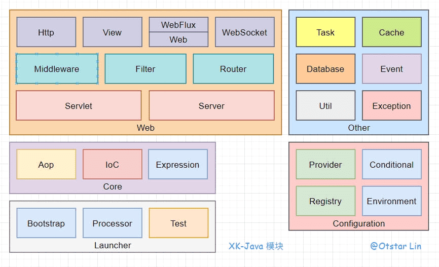

## 前言

自制的 JavaWeb 框架 XK-Java 至今也开发了快一年的时间了，如果算上第一个 commit 之前的准备时间差不多就一年了，最近应该也不会再有大的结构更新了，所以就打算和之前 PHP 框架系列一样，写一个系列文章。也算是对这些技术的复盘吧，顺便如果可以的话也可以连 Spring 一起分析下。

**观前提示**：XK-Java 并不是 Spring 的缩小版，大部分模块都是由我自行实现的，所以原理也大不相同（当然有一些是 copy 自 Spring 的就另外说，逃），如果你是想通过本框架来学习 Spring 的话基本可以绕道了。

## 目录

1. [从零实现一个 Java 微框架 - 前言](/post/implement-a-java-microframework-from-zero-1)
2. [从零实现一个 Java 微框架 - IoC](/post/implement-a-java-microframework-from-zero-2)

## 项目地址

<repo name={"syfxlin"} repo={"xkjava"} />

<message>
  系列文章讲解的代码都会通过注解标记到代码的第一行，由于文章编写的时候框架应该还会继续开发，所以请尽量按链接访问指定
  commit 的代码，避免代码不同的情况。
</message>

## 整体结构



这张图只展示了框架中包含的架构和各模块之间的关系，模块中的东西会在后续的文章中说明。

## 框架成果

```java
@Controller
@RequestMapping("/test")
public class TestController {

    private static final Logger log = LoggerFactory.getLogger(
        TestController.class
    );

    @Autowired
    List<Advice> list;

    @Autowired
    Advice[] advice;

    @Autowired
    List<Advice>[] lists;

    @Autowired
    ObjectProvider<Advice> adviceObjectProvider;

    @Autowired
    ObjectProvider<String> notFoundObjectProvider;

    @Autowired(value = "name", required = false)
    private String name;

    @GetMapping("/{id}")
    public String test(final int id) {
        return "test";
    }

    @GetMapping("/get-a")
    public int getAnnotation(@QueryValue final int id) {
        return id;
    }

    @PostMapping("/post-a")
    public int postAnnotation(@BodyValue final int id) {
        return id;
    }

    @CrossOrigin
    @GetMapping("/header-a")
    public String headerAnnotation(@HeaderValue final String host) {
        return host;
    }

    @PostMapping("/post")
    @ResponseStatus
    // @VerifyCsrf
    public String post(
        @BodyValue final JsonNode user,
        @DataBind(name = "user") final User user2,
        @WebBind(
            name = "name",
            type = Type.PATH,
            converter = TestConverter.class
        ) final String name,
        @WebBind(name = "user3") final User2 user3,
        @Valid @DataBind(name = "user4") final User2 user4,
        // 如果不传入这两个其中一个参数，则会抛出异常
        final ValidGroup validGroup,
        final ValidResult<User2> validResult
    ) {
        return "post";
    }

    @PostMapping("/body")
    public String body(
        @DataBind(name = "&body") final JsonNode body,
        @DataBind final User2 user2,
        @DataBind(name = "request") final HttpServletRequest request
    ) {
        return "body";
    }

    @GetMapping("/case")
    public String getCase(final String userName) {
        return userName;
    }

    @GetMapping("/session-context")
    public String sessionContext(final SessionTest sessionTest) {
        if (sessionTest.getName() == null) {
            sessionTest.setName("Otstar Lin");
            return sessionTest.getName();
        } else {
            return sessionTest.getName() + "-Copy";
        }
    }

    @GetMapping("/result-empty")
    public String resultEmpty() {
        return "empty:";
    }

    @GetMapping("/result-html")
    public String resultHtml() {
        return "html:<h1>Html Result</h1>";
    }

    @GetMapping("/result-json")
    public String resultJson() {
        return "json:{\"type\": \"Json Result\"}";
    }

    @GetMapping("/result-redirect")
    public String resultRedirect() {
        return "redirect:/result-json";
    }

    @GetMapping("/result-text")
    public String resultText() {
        return "text:Text Result";
    }

    @GetMapping("/result-view")
    public String resultView(final Model model) {
        model.addAttribute("name", "View Result");
        return "view:index";
    }

    @GetMapping("/result-no-match")
    public String resultNoMatch() {
        return "No Match Result";
    }

    @GetMapping("/result-ignore")
    public String resultIgnore() {
        return ":empty:";
    }

    @GetMapping("/result-status")
    public String resultStatus(final Model model) {
        model.status(HttpStatus.BAD_REQUEST);
        return "text:Status Result";
    }

    @GetMapping("/default")
    public String defaultValue(
        @QueryValue(name = "name", defaultValue = "default") final String name
    ) {
        return name;
    }

    @GetMapping("/stream")
    public StreamResult stream() throws FileNotFoundException {
        return Result.stream(
            "video/mp4",
            IoUtil.toStream(
                ResourceUtils.getFile(
                    "file:/E:/Data/Videos/天气之子/天气之子.mp4"
                )
            )
        );
    }

    @GetMapping("/file")
    public File file() {
        return FileUtil.file("file:/E:/Data/Videos/天气之子/天气之子.mp4");
    }

    @GetMapping("/async")
    public Callable<String> async() {
        return () -> {
            log.info("Callable");
            return "result";
        };
    }

    @GetMapping("/async-task")
    public WebAsyncTask<String> asyncTask() {
        final WebAsyncTask<String> asyncTask = new WebAsyncTask<>(
            () -> {
                log.info("WebAsyncTask");
                return "result";
            }
        );
        asyncTask.onCompletion(
            () -> {
                log.info("WebAsyncTask completion");
            }
        );
        return asyncTask;
    }

    @GetMapping("/async-result")
    public AsyncResult<String> asyncResult() {
        return context -> {
            Result
                .file("file:/E:/Data/Videos/天气之子/天气之子.mp4")
                .toResponse(context.request(), context.response(), null);
            return null;
        };
    }

    @GetMapping("/deferred")
    public WebDeferredTask<String> deferred() {
        final WebDeferredTask<String> deferredTask = new WebDeferredTask<>();
        new Thread(
            () -> {
                try {
                    Thread.sleep(1000L);
                } catch (final InterruptedException e) {
                    log.error("Deferred sleep error", e);
                }
                log.info("Deferred set result");
                deferredTask.result("deferred");
            }
        )
            .start();
        return deferredTask;
    }

    @GetMapping("/async-timeout")
    public WebAsyncTask<String> asyncTimeout() {
        final WebAsyncTask<String> asyncTask = new WebAsyncTask<>(
            () -> {
                log.info("Async timeout sleep");
                try {
                    Thread.sleep(3000L);
                } catch (final Exception e) {
                    log.error("Async sleep error", e);
                }
                return "result";
            }
        );
        asyncTask.timeout(1000L);
        asyncTask.onTimeout(
            () -> {
                log.info("Timeout");
                return "timeout";
            }
        );
        return asyncTask;
    }

    @GetMapping("/async-pool")
    @WebAsync("testAsyncExecutor")
    public Callable<String> asyncPool() {
        return () -> {
            log.info("Callable");
            return "result";
        };
    }

    @GetMapping("/reactive-mono")
    public Mono<String> reactiveMono() {
        return Mono.just("mono");
    }

    @GetMapping("/reactive-flux")
    public Flux<String> reactiveFlux(final Response response) {
        response.contentType("text/event-stream");
        response.header("Cache-Control", "no-cache");
        return Flux
            .interval(Duration.ofSeconds(1))
            .map(
                seq ->
                    String.format("id:%d\nevent:random\ndata:%d\n\n", seq, seq)
            )
            .doOnNext(System.out::println);
    }

    @Bean
    public static ExecutorService testAsyncExecutor() {
        return new ThreadPoolExecutor(
            3,
            3,
            0L,
            TimeUnit.SECONDS,
            new LinkedBlockingQueue<>(),
            ThreadUtil.newNamedThreadFactory("testAsyncExecutor-", true)
        );
    }

    @InitBinder
    public void binder(final WebDataBinder binder) {
        final User2 user2 = new User2();
        user2.setName("user3");
        user2.setAge(17);
        binder.addDefault("user3", user2);
        binder.addDefault("user4.name", "user4");
    }

    @PreDestroy
    public void destroy() {
        System.out.println("TestController destroy");
    }

    public static class TestConverter implements Converter {

        @Override
        public Object before(
            final Object object,
            final String name,
            final TypeWrapper<?> type,
            final MergedAnnotation annotation,
            final Container container
        ) {
            return "test-converter";
        }
    }
}
```

更多的样例可以到 [xkjava-app](https://github.com/syfxlin/xkjava/tree/ce06902e7b8b6650791c41aa0ce13c291b311969/xkjava-app/src/main/java/me/ixk/app) 模块里查看。

## 结语

本篇文章只是一个开篇，所以是一篇水文 2333。

XK-Java 参考了以下框架：

- [Spring](https://spring.io/)
- [Blade](https://github.com/lets-blade/blade)
- [Javalin](https://github.com/tipsy/javalin/)
- [Laravel](https://laravel.com/)
- [Swoft](https://www.swoft.org/)
- [XK-PHP](https://github.com/syfxlin/xkphp)

感谢这些框架为我提供了实现和学习的思路。
