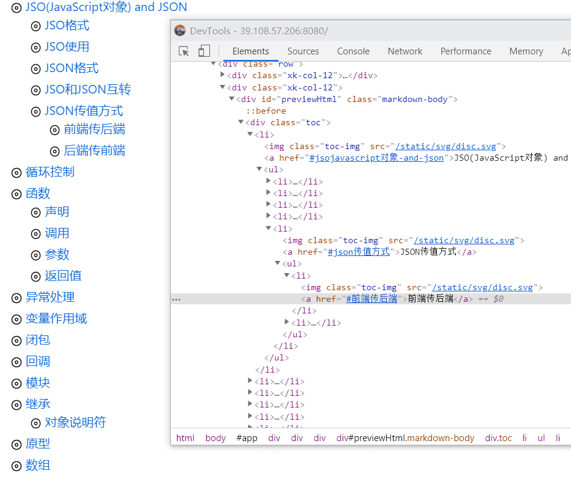

> 上一篇文章我们使用 PHP 的构建简单的目录树，这次由于一个项目的需要（构建标题大纲），需要在前端使用 JS 构建 ul li 的多层次列表，其实就是类似于 ZUI 的树形菜单啦(￣ ▽ ￣)"

## 实现原理

首先需要准备一个对象数组，数组中的对象拥有`level`和`title`（可以自行命名，由于博主是生成标题的索引所以就使用 title 命名）

另外，该数组需要按一定的顺序进行排序，否则就需要自行设置索引，排序的规则是子级必须紧跟在父级后，例如

```javascript
// # 1
// ## 2
// ## 3
// ### 4
// ### 5
// # 6

var tocContent = [
  {
    level: 1,
    title: "1"
  },
  {
    level: 2,
    title: "2"
  },
  {
    level: 2,
    title: "3"
  },
  {
    level: 3,
    title: "4"
  },
  {
    level: 3,
    title: "5"
  },
  {
    level: 1,
    title: "6"
  }
];
```

有了目录的对象数组，我们就可以通过递归或者栈来构建列表树了

## 实现代码

### 构建 HTML

```javascript
var tocContent = [];
function getTocHtml() {
  var html = getTocHtmlTree(0, "");
  window.$toc = html;
  return html;
}
function getTocHtmlTree(index, str) {
  if (index >= tocContent.length) return str;
  if (index == 0) {
    str += "";
  } else if (tocContent[index].level > tocContent[index - 1].level) {
    for (
      let i = tocContent[index - 1].level;
      i < tocContent[index].level;
      i++
    ) {
      str += "<ul>";
    }
  } else if (tocContent[index].level < tocContent[index - 1].level) {
    for (
      let i = tocContent[index].level;
      i < tocContent[index - 1].level;
      i++
    ) {
      str += "</ul></li>";
    }
  } else {
    str += "</li>";
  }
  str +=
    '<li><a href="#' +
    tocContent[index].title
      .toLowerCase()
      .replace(/ /g, "-")
      .replace(/[^\u4e00-\u9fa5a-zA-Z0-9-]/g, "") +
    '">' +
    tocContent[index].title +
    "</a>";
  return getTocHtmlTree(index + 1, str);
}
```

通过调用`getTocHtml()`就可以获得目录的 HTML，生成后的效果如下



从代码中可以看到在 li 标签中还有`img`标签和带锚点的`a`标签，a 标签是为了跳转到指定位置而设置的，可以按不同的需求进行调整，img 标签是为了点击时显示和隐藏子级列表而设置的

### 为目录添加 toggle 功能

废话不多说，先上代码

```javascript
function initTocTree() {
    var items = document.querySelectorAll('#toc .toc-img ~ ul') for (let i = 0; i < items.length; i++) {
        items[i].parentNode.children[0].setAttribute('src', '/static/svg/minus-square.svg');
        items[i].parentNode.children[0].setAttribute('onclick', 'toggleToc(this)');
    }
}
function toggleToc(ele) {
    var display = ele.nextElementSibling.nextElementSibling.style.display
    if (display === '' || display === 'block') {
        ele.nextElementSibling.nextElementSibling.style.display = 'none';
        ele.setAttribute('src', '/static/svg/plus-square.svg');
    } else {
        ele.nextElementSibling.nextElementSibling.style.display = 'block';
        ele.setAttribute('src', '/static/svg/minus-square.svg');
    }
}
```

`initTocTree()`是用来初始化列表树的，该函数会修改有子列表点的父级列表图片，并为其添加 onclick 事件，`toggleToc()`是在 img 标签被点击的时候展开/隐藏子级列表的，同时修改其 img 图像，便于用户判断子列表是否已经展开，具体效果如下


虽然有上篇文章的参考我还是想了很久，写出来的代码也很渣，看来还需不断的学习啊＞﹏＜
