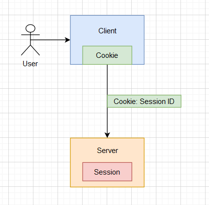
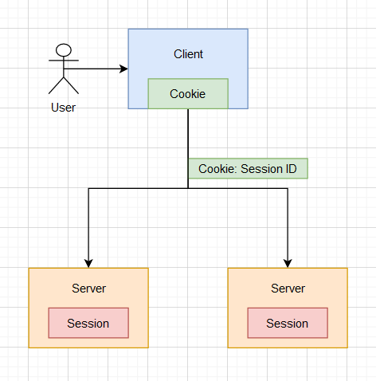
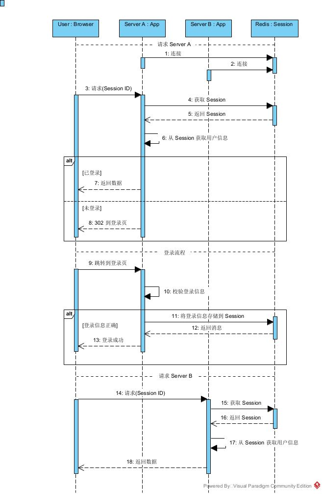
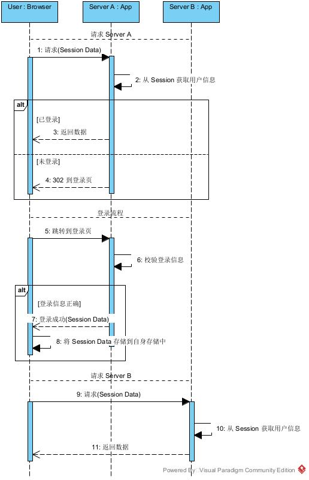
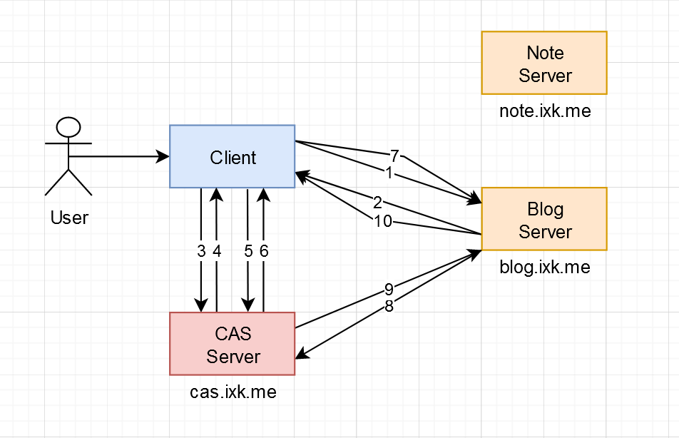
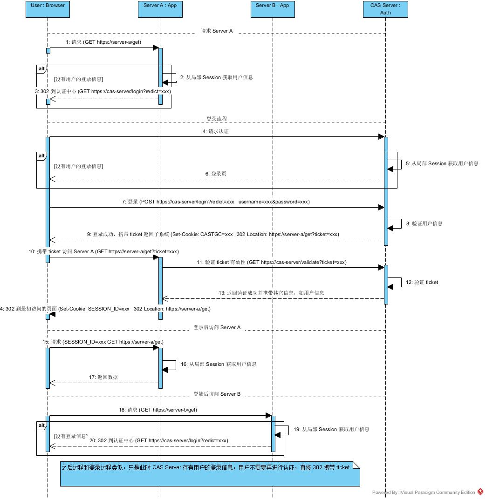

## 前言

前不久因为新的项目用到了微服务，有了单点登录的需求，折腾了好几种方案。好久没写文章了，周末还要上课，闲得慌就写了这篇文章。

## 什么是单点登录

**单点登录（Single Sign On）**，一般简称为 SSO，是整合多系统登录的一种解决方案。

单点登录的定义是在多个应用系统中，用户只需要进行一次登录，即可访问所有被信任的应用系统，而无需再再次登录。

在单点登录的系统一般由**一个认证中心**，以及**多个可信子系统**组成。其中认证中心负责处理用户的登录登出操作，当用户登录后，认证中心会返回一个**授权令牌**（可以是 Token 或其他信息），用户拿到这个授权令牌的时候就可以拿着这个令牌访问其他可信的子系统，子系统拿到用户的授权令牌的时候会进行**鉴权**，一般是将该令牌交给认证中心进行认证，认证成功后创建局部会话，避免频繁的前往认证中心认证。

举个实际的例子吧：当我们登录淘宝的时候，如果再去访问天猫，天猫就不需要再进行登录操作了，这种就是单点登录。

## 单系统登录

在了解单点登录前我们先回顾一下单系统登录的方式。由于 HTTP 是**无状态**的协议，所以服务器无法确认用户的信息。为了解决这个问题，Cookie 和 Session 就因此出现了。举个例子吧，当我们去银行取款的时候，我们需要出示银行卡等证件，这个银行卡就相当于 Cookie，柜台职员就可以因此知道你的身份，而柜台职员拿到你的银行卡的时候就要去查询你银行卡中的余额，此时存放余额信息的数据库就相当于 Session 存储，其中银行卡号就是 Session ID，每个银行卡号对应着一个账户（Session Data）。

在单系统中，当我们进行登录的时候，服务器会把登录的信息存入到 Session 中，并返回一个 Session ID 到 Cookie。当用户访问的时候，浏览器会自动的带上 Cookie，服务器拿到 Session ID 的时候再去查询是否有登录信息。此时由于是单系统，只有一个域名，所以 Cookie 也只有一个，同时 Session 虽然可以使用 Redis 等方式进行分布式部署，但在逻辑上也只能存在一个。

## 多系统登录

### Session 不共享问题

在单系统的登录中，我们一般是使用 Session 来存储登录的用户信息。当系统变成多个了，那么 Session 的存储自然就变成了多个互相隔离的 Session 存储，如下图：

此时如果用户通过左边的系统登录了，那么当用户访问右边的服务的时候，由于 Session 不共享的原因，右边服务的 Session 实际上并没有存在用户的登录信息，系统会判断用户没有登录。

解决方案通常有两种：

- 同步 Session：当用户登录（修改了 Session）后，此时该系统会将修改的 Session 同步到其他系统上，保证 Session 在逻辑上是单个（一致）的。
- 集中存储 Session：既然多系统是多导致的不共享问题，那么我们只要把这个多变成单就完事了，第二种方式就是通过将 Session 存储于一个单一的存储系统来解决不共享的问题。通常情况下是使用 Redis 来存储。

### Cookie 不共享问题

在单系统的登录中，一个用户对应了一个 Session，这个对应关系是通过存放于 Cookie 的 Session ID 来实现的。在多系统中，我们通常会为每个系统分配一个不同的域名，由于浏览器默认不会携带其他域名的 Cookie，所以会遇到 Cookie 不共享的问题。

解决方案通常也有两种：

- 设置父域名 Cookie，使子域名共享使用相同的 Cookie。
- 利用 Token 代替 Cookie 传输和存储 Session ID，前端发送请求时携带这个 Token。

## 实现

实现方式有挺多种的，这里就只写几种比较常用的方案吧。

### 共享 Cookie + 共享 Session

当所有系统的域名都附属于某个父域的时候，如 `blog.ixk.me` 和 `note.ixk.me` 就是属于 `ixk.me` 这个父域名，当 Cookie 设置的域名是父域的时候这时候当访问子域的时候浏览器会自动把设置为父域的所有 Cookie 一起发送到后端，其中包含了 Session ID。

后端利用 Redis 实现共享 Session，拿到通过 Cookie 传入的 Session ID 的时候再到 Redis 查询，取得 Session 数据，其中数据包含了用户登录的信息。

### Token + 共享 Session

共享 Cookie + 共享 Session 的方案有一个问题，那就是域名需要有共同的父域名，如果我们的系统有其他的域名如 `www.baidu.com` 和 `blog.ixk.me`，这样我们就没法利用到共享 Cookie 的方式了。此时我们要使用 Token，即手动传递 Session ID 的方式，让服务端能取得对应用户的 Session 数据，然后进行登录验证。

后端和共享 Cookie + 共享 Session 的方案一样，使用 Redis 存储 Session 数据。

序列图和共享 Cookie + 共享 Session 一致，只是请求的时候多了个一个 Token 参数，所以这里就不再重复放了。

### 客户端 Session

还有一种方案是直接抛弃服务端 Session 和 Cookie，直接由客户端存储 Session，每次请求的时候都带上 Session 数据，服务端拿到数据后进行解析和使用，验证用户登录。

但是既然是存放于客户端的数据，那么要怎么防止数据被篡改呢。通常情况下的会使用签名或加密的方式。在登录后，服务端将登录的信息数据进行签名或加密，然后发送到客户端，当客户端请求的时候原封不动的携带这些数据发送到服务端，当服务端拿到后进行签名验证或解密。如果客户端篡改了数据，那么签名验证就会出错，如果是加密的，那么客户端无法看到原文自然也无法篡改。

### CAS

CAS（Central Authentication Service）即中心授权服务，是一种实现了 SSO 的授权框架。

认证过程：

1. 访问 Blog Server。
2. Blog Server 通过携带的 `blog.ixk.me` 的 Session ID，取得 Session，发现里面没有登录信息，响应 302 跳转到 `cas.ixk.me`。
3. 302 自动跳转到 CAS Server
4. CAS Server 通过携带的 `cas.ixk.me` 的 Cookie，验证没有登录，302 跳转到 `cas.ixk.me` 的登录界面。
5. 用户输入用户名密码登录。
6. CAS Server 验证用户名密码成功，设置 Cookie，同时 302 到 `blog.ixk.me` 此时的 302 跳转的 URL 携带了 ticket 的参数。
7. 302 自动跳转到 Blog Server，携带 ticket。
8. Blog Server 从参数取得 ticket，携带 ticket 访问 CAS Server，验证是否有效。
9. CAS Server 验证 ticket 有效，返回用户信息或其他需要的信息。
10. Blog Server 拿到信息后，存入自己的 Session 中，然后设置 Cookie，同时 302 跳回原本访问的地址，此时客户端可以随意访问 Blog Server 授权的任何端点，Blog Server 在本系统 Session 未过期的时候都不需要再访问 CAS Server。

如果此时用户访问了 Note Server，Note Server 此时并没有用户登录的信息，所以和认证过程 2 一样，跳转到 CAS Server，此时 CAS 的登录还有效，和认证过程 6 一样，302 回 Note Server 同时携带 ticket，Note Server 取得 ticket 后的过程就和认证过程 8-10 一样了。

从上面的流程可以看到，CAS 局部还是使用传统的 Cookie + Session 方式，只是当子系统不存在登录状态的时候将用户重定向到认证中心进行认证，认证中心返回一个 ticket，各子系统再拿着这个 ticket 去认证中心验证。验证成功后就创建局部 Session，此时就和单系统登录差不多了。

### OAuth

OAuth 是一种授权框架，允许第三方应用通过用户授权的形式访问服务中的用户信息，最常见的场景是授权登录，它有 4 种访问模式：

- 授权码模式（Authorization Code）
- 简化模式（Implicit）
- 密码模式（Resource owner password credentials）
- 客户端模式（Client credentials）

其工作流程也和 CAS 类似，不过 OAuth 可以为第三方应用授权，即子系统在访问认证中心前需要事先配置 `client_id` 和 `client_secret`，访问时携带这两个认证数据（授权码模式），此时认证中心才会允许子系统进行访问，这也就使得 OAuth 不在局限于自己的系统，而是可以将认证的功能提供给第三方应用使用，如 Google 和 Github 可以授权给第三方应用认证。

具体的可以看这篇文章：[理解 OAuth 2.0 认证流程](https://lotabout.me/2020/OAuth-2-workflow/)，文章里已经包含了比较完整的序列图，所以我就不画了，画序列图超级麻烦的 🤣。

## 结语

写了一个晚上 + 半个下午，写文章挺花时间的。最近都在偷懒和写项目，所以框架的文章一直都没写，等过几天找个时间更新下吧（逃。
