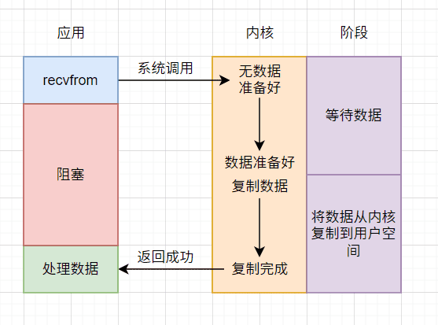
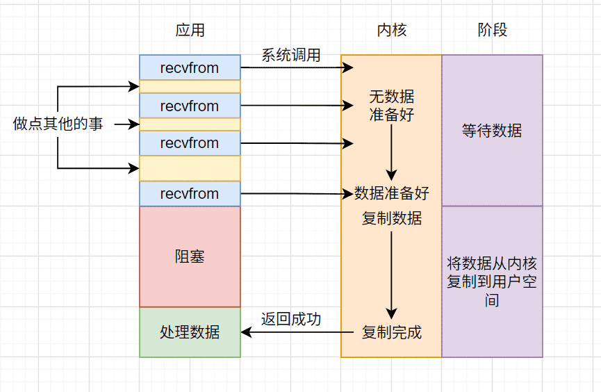
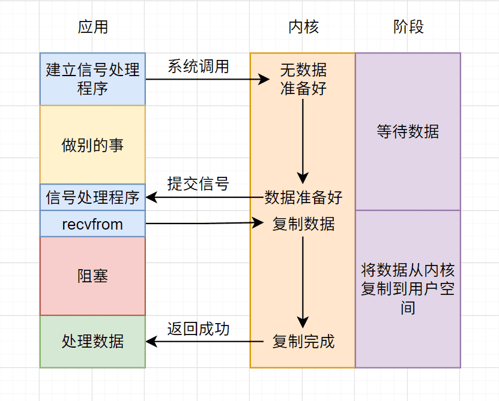
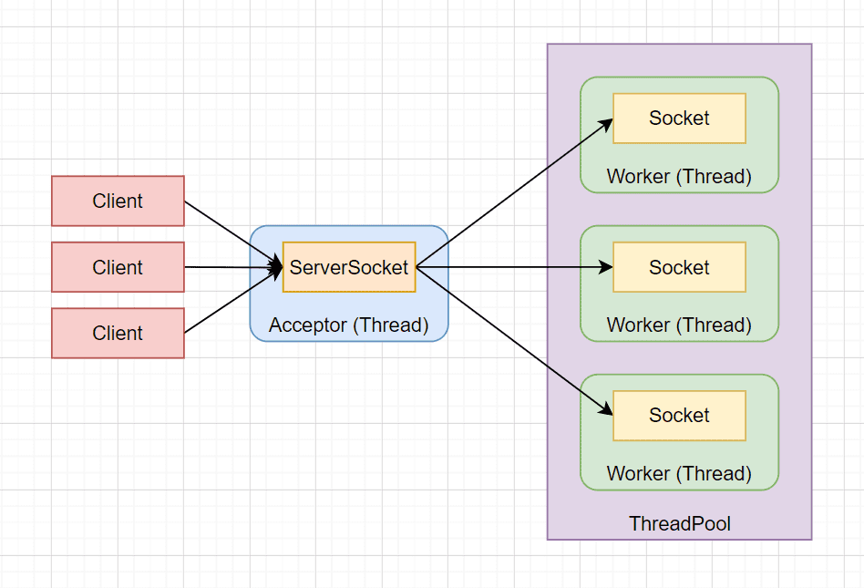
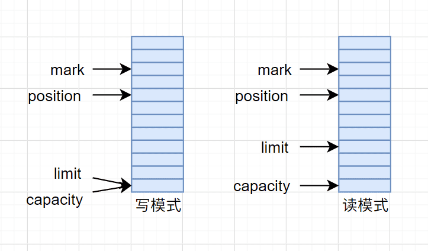
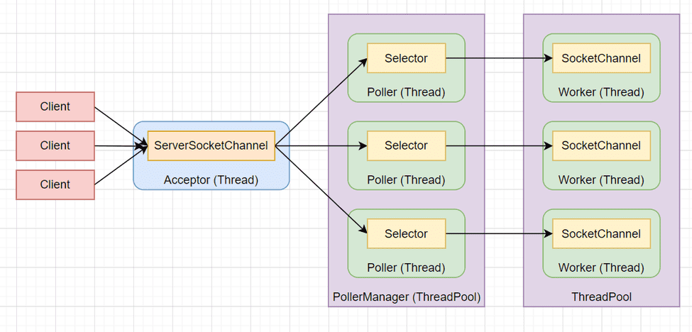

## 前言

最近也不知道该学什么，干脆就把之前学的的 IO 相关的东西翻出来写一篇文章吧。

## 概念

首先我们需要了解 **阻塞、非阻塞、同步、异步** 这些概念。之前的 [浅谈并发：基础](https://blog.ixk.me/talking-about-concurrency-basics.html "浅谈并发：基础") 一文上有写了相关的概念，虽然那写的是面向线程的概念，不过在 IO 通讯上也是类似的。所以这里就不再说明了。

**同步与异步**关注的是**消息通信机制**。**阻塞与非阻塞**关注的是**程序在等待调用结果时的状态**。

<table>
  <tbody>
    <tr>
      <td>
        <strong>类型</strong>
      </td>
      <td>
        <strong>举例</strong>
      </td>
      <td>
        <strong>效率</strong>
      </td>
    </tr>
    <tr>
      <td>同步阻塞</td>
      <td>在咖啡店里柜台前排队等，不能做其他的事</td>
      <td>最低</td>
    </tr>
    <tr>
      <td>同步非阻塞</td>
      <td>在咖啡店里排队等时一边玩着手机一边不断的检查是否到自己了</td>
      <td>较低</td>
    </tr>
    <tr>
      <td>异步阻塞</td>
      <td>向咖啡店里的服务员点单，点完后在自己的位置上等待，不能做其他的事</td>
      <td></td>
    </tr>
    <tr>
      <td>异步非阻塞</td>
      <td>
        向咖啡店里的服务员点单，点完后打开电脑开始工作，直到服务员送上来。
      </td>
      <td>最高</td>
    </tr>
  </tbody>
</table>

## IO 模型

有了上面的一些概念，我们就可以来看看以下五种场景的 IO 模型了。

### 阻塞 IO（Bloking IO）



### 非阻塞 IO（Non-Blocking IO）



### IO 复用（IO Multiplexing）


### 信号驱动 IO（Signal-driven IO）



### 异步 IO（Asynchronous IO）


## Java 中的 IO

### BIO

Java 中的 BIO 是 Java 中最开始提供的一种 IO 模型，对应上面五种中的阻塞 IO。在 JDK 中是在 `java.io` 包中。使用起来极其简单但是性能并不好。通常采用如下的架构：



以下是一段样例：

```java
public class BioServer {

    public static void main(final String[] args) throws Exception {
        // 用一个线程池处理接收到的请求
        final ExecutorService executor = ThreadUtil.newExecutor(10);
        // 监听 8080 端口
        final ServerSocket serverSocket = new ServerSocket(8080);
        while (!Thread.interrupted()) {
            // 阻塞式接收请求
            final Socket socket = serverSocket.accept();
            // 每当有新的请求到来，将其放到线程池中处理
            executor.submit(
                () -> {
                    try (
                        final InputStream inputStream = socket.getInputStream();
                        final OutputStream outputStream = socket.getOutputStream();
                    ) {
                        // 输入
                        final BufferedReader reader = IoUtil.getReader(
                            inputStream,
                            StandardCharsets.UTF_8
                        );
                        while (true) {
                            final String line = reader.readLine();
                            if (line == null || "bye".equals(line)) {
                                break;
                            }
                            log.info("Input: {}", line);
                            IoUtil.writeUtf8(outputStream, false, line);
                        }
                        // 输出

                        socket.shutdownInput();
                        socket.shutdownOutput();
                        socket.close();
                    } catch (final Exception e) {
                        log.error("Error", e);
                    }
                }
            );
        }
    }
}
```

### NIO

Java NIO 是 Java IO 模型中最重要的 IO 模型，在 JDK 中是在 `java.nio` 包下，NIO 是 New IO 的简称，一般也称为 Non-block IO 不过它其实对应的是上面五种 IO 模型中的非阻塞 IO 和 IO 复用，其本身是 IO 复用的，但是同时可以切换为阻塞或非阻塞两种模式。

在 NIO 中有三个重要的概念：

- **缓冲区（Buffer）**：缓冲区用于存储数据。
- **通道（Channel）**：通道类似于以前的 `InputStream` 和 `OutputStream` 用于读写操作，不过与之不同的是，`Channel` 是双向的。
- **多路复用器（Selector）**：顾名思义就是提供 IO 复用的东西，通过注册多个 `Channel` 到 `Selector` 中，当某个 `Channel` 关心的事件就绪的时候 `select()` 方法就会返回，线程就可以处理这些事件，事件的例子有如新的连接进来、数据接收等。

三者关系的简单模型：


#### Buffer

**Buffer** 本质上可以看成一个容器，在 NIO 中对数据的操作都是通过 Buffer 完成的。除了 `Boolean` 类型没有对应的 Buffer 外其他基本类型都有其对应的 `Buffer` 类，其中最常用的就是 `ByteBuffer` 了。Buffer 可以存储于堆中同时也可以存储于直接内存里。

Buffer 虽然可以进行读写操作，不过读写操作并不能同时进行，是半双工的，Buffer 分成了读模式和写模式，其切换的方法如下：

- **初始状态**：写模式
- **写模式 => 读模式**：`flip()` 方法
- **读模式 => 写模式**：`compact()` 或者 `clear()` 方法
- **重新读写**：`rewind()` 方法

在 Buffer 中有 4 个重要的属性，用于索引和标记：

- **容量（capacity）**：用于标记 Buffer 的大小。
- **位置（position）**：用于标记 Buffer 当前读或写的位置。
- **限制（limit）**：该属性在读模式下等同于 `size`，标记了有效数据的大小。在写模式下等同于 `capacity`，标记了可以写入的最大大小。一旦 `position` 超过了 `limit` 这抛出异常。
- **标记（mark）**：调用 `mark()` 标记一个位置，之后可以通过 `reset()` 方法恢复 `position` 到该位置。

两种模式下的属性位置图：



#### Channel

**Channel** 是程序读写数据的通道，通过 Channel 我们可以将数据从源读到 Buffer，也可以从 Buffer 写入到源里。它是全双工的。在 Java 中常用的 Channel 有以下几种：

- **FileChannel**：用于文件的读写，**不能设置为非阻塞模式**。
- **DatagramChannel**：用于 UDP 数据读写。
- **SocketChannel**：用于 TCP 数据读写。
- **ServerSocketChannel**：监听 TCP 连接请求。当收到请求后返回 SocketChannel。

#### Selector

**Selector** 是多路复用器，一般也可以直译为选择器，其功能简单来说就是通过轮询注册在其上的 Channel 是否就绪，如果就绪了就会被选择出来，这样程序就可以对这些就绪的 Channel 进行读写操作了。Selector 在 Linux 上依赖于 epoll，在 Windows 上则是 iocp。Linux 的 epoll 使用的是 Reactor 的模式，在网络编程中常用的是 Reactor 和 Proactor 模式，详细的内容可以参考 [Java NIO 浅析](https://tech.meituan.com/2016/11/04/nio.html)。

Selector 和 Channel 是通过 SelectionKey 关联起来的，但 Channel 注册到 Selector 中时就能得到一个 SelectionKey，其作用相当于 ID，用于区分不同的 Channel。

Selector 可以监听以下 4 种事件：

- **OP_CONNECT**：表示连接建立成功了。
- **OP_ACCEPT**：监听是否有新的请求到来。
- **OP_READ**：监听是否有新的数据到来。
- **OP_WRITE**：监听是否可写。

以下是一段样例：

```java
public class NioServer {

    public static void main(final String[] args) throws Exception {
        final ExecutorService executor = ThreadUtil.newExecutor(10);
        final Poller poller = new Poller();
        final Acceptor acceptor = new Acceptor(poller);
        // 启动 Poller
        executor.execute(poller);
        // 启动 Acceptor
        executor.execute(acceptor);
    }

    public static class Acceptor implements Runnable {

        private final ServerSocketChannel acceptor;
        private final Poller poller;

        public Acceptor(final Poller poller) throws IOException {
            // 开启 ServerSocketChannel，同时绑定端口
            this.acceptor = ServerSocketChannel.open();
            this.acceptor.bind(new InetSocketAddress(8080));
            this.poller = poller;
        }

        public void accept() throws IOException {
            if (this.acceptor != null && this.acceptor.isOpen()) {
                // 阻塞式等等请求到来
                final SocketChannel channel = this.acceptor.accept();
                this.accepted(channel);
            }
        }

        public void accepted(final SocketChannel channel) throws IOException {
            if (channel != null && channel.isOpen()) {
                // 将 SocketChannel 设置为非阻塞，注册到 Selector 中
                channel.configureBlocking(false);
                this.poller.register(channel);
                // 唤醒 Selector
                this.poller.up();
            }
        }

        @Override
        public void run() {
            while (!Thread.interrupted()) {
                try {
                    // 循环处理请求
                    this.accept();
                } catch (final Throwable e) {
                    log.error("Accept error", e);
                }
            }
        }
    }

    public static class Poller implements Runnable {

        private final Selector selector;

        public Poller() throws IOException {
            this.selector = Selector.open();
        }

        public void register(final SelectableChannel channel)
            throws ClosedChannelException {
            channel.register(this.selector, SelectionKey.OP_READ);
        }

        public void up() {
            this.selector.wakeup();
        }

        @Override
        public void run() {
            while (!Thread.interrupted()) {
                try {
                    // 轮询
                    final int selected = this.selector.select();
                    if (selected == 0) {
                        continue;
                    }
                    // 当查询到的时候就进行处理
                    final Iterator<SelectionKey> iterator =
                        this.selector.selectedKeys().iterator();
                    while (iterator.hasNext()) {
                        final SelectionKey key = iterator.next();
                        iterator.remove();
                        final SocketChannel channel = (SocketChannel) key.channel();
                        // 输入
                        final ByteBuffer buffer = ByteBuffer.allocate(1024);
                        channel.read(buffer);
                        buffer.flip();
                        final String input = StrUtil
                            .str(buffer, StandardCharsets.UTF_8)
                            .trim();
                        log.info("Input: {}", input);
                        // 输出
                        channel.write(ByteBuffer.wrap(input.getBytes()));
                    }
                } catch (final IOException e) {
                    log.error("Select error", e);
                }
            }
        }
    }
}
```

这里的样例所使用的架构类似于 Jetty 和 Tomcat，由 Acceptor 负责接收请求，是阻塞的，接受到请求后将 SocketChannel 注册到 Poller 也就是 Selector 中，由 Poller 负责轮询可读和可写状态。本例为了简单一点将 IO 的处理放在了 Poller 中，实际的架构上应放到线程池中进行处理，解放 Poller，使其进行下一轮的轮询。同时本例只使用了一个 Acceptor 和 Poller，实际的架构中一般会设置多个。

具体的架构如下：



上面的架构是相对简单的，一般来说会使用更复杂的方式来压榨每一分性能，比如 Jetty 的 [EatWhatYouKill](https://blog.ixk.me/talk-about-eatwhatyoukill.html)，Netty 的 EventLoop 等等。

### AIO

说完了 NIO，接下来就是 AIO 了，AIO 一般也称 NIO2，是在 Java7 后新增的异步非阻塞 IO 实现。不再需要 Selector 进行轮询，而是通过监听的方式。简单来说就是不再是**我去拿**，而是**你给我**。这个概念也是反应式编程中一个重要的概念（消息驱动）。

以下是一段样例代码：

```java
public class AioServer {

    public static void main(final String[] args)
        throws IOException, InterruptedException {
        CountDownLatch countDownLatch = new CountDownLatch(1);
        // 开启 AsynchronousServerSocketChannel
        final AsynchronousServerSocketChannel accept = AsynchronousServerSocketChannel.open();
        accept.bind(new InetSocketAddress(8080));
        // 接受请求
        accept.accept(accept, new AcceptHandler());
        // 使主线程等等，否则 Channel 会停止，在生成环境一般用线程池不存在这个问题。
        countDownLatch.await();
    }

    public static class AcceptHandler
        implements
            CompletionHandler<AsynchronousSocketChannel, AsynchronousServerSocketChannel> {

        @Override
        public void completed(
            AsynchronousSocketChannel channel,
            AsynchronousServerSocketChannel attachment
        ) {
            // 需要注意，accept 的处理器只会执行一次，所以为了能连续执行，就需要再次注册
            attachment.accept(attachment, this);
            // 申请 ByteBuffer，将读任务交给 ResultHandler 处理
            ByteBuffer buffer = ByteBuffer.allocate(1024);
            channel.read(buffer, buffer, new ResultHandler(channel));
        }

        @Override
        public void failed(
            Throwable exc,
            AsynchronousServerSocketChannel attachment
        ) {
            log.error("AcceptHandler failed", exc);
        }
    }

    public static class ResultHandler
        implements CompletionHandler<Integer, ByteBuffer> {

        private final AsynchronousSocketChannel channel;

        public ResultHandler(AsynchronousSocketChannel channel) {
            this.channel = channel;
        }

        @Override
        public void completed(Integer result, ByteBuffer buffer) {
            // 输入
            buffer.flip();
            final String input = StrUtil
                .str(buffer, StandardCharsets.UTF_8)
                .trim();
            log.info("Input: {}", input);
            final ByteBuffer write = ByteBuffer.wrap(input.getBytes());
            // 输出
            channel.write(
                write,
                write,
                new CompletionHandler<>() {
                    @Override
                    public void completed(
                        Integer result,
                        ByteBuffer attachment
                    ) {
                        // 未写完则继续写
                        if (attachment.hasRemaining()) {
                            channel.write(attachment, attachment, this);
                        } else {
                            // 否则就再次注册处理器，这样就可以连续读了
                            ByteBuffer buffer = ByteBuffer.allocate(1024);
                            channel.read(
                                buffer,
                                buffer,
                                new ResultHandler(channel)
                            );
                        }
                    }

                    @Override
                    public void failed(Throwable exc, ByteBuffer attachment) {
                        log.error("ResultHandler failed", exc);
                    }
                }
            );
        }

        @Override
        public void failed(Throwable exc, ByteBuffer buffer) {
            log.error("ResultHandler failed", exc);
        }
    }
}
```

## 结语

写了好几天了，总算摸完了。主要是最近都在折腾路由器、折腾手机等等。还有这个垃圾 WordPress 的编辑器，越来越卡，刚出那段时间挺好用的，越升级越难用。所以打算换成 Gatsby 了，由于要迁移主题，所以应该没那么快上线 🤣。
