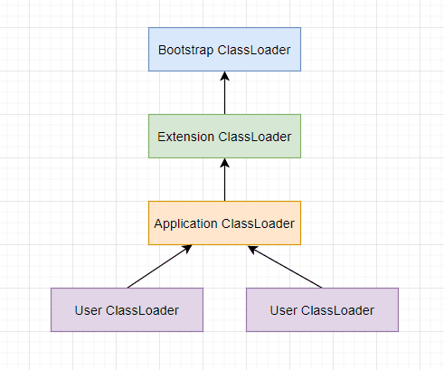
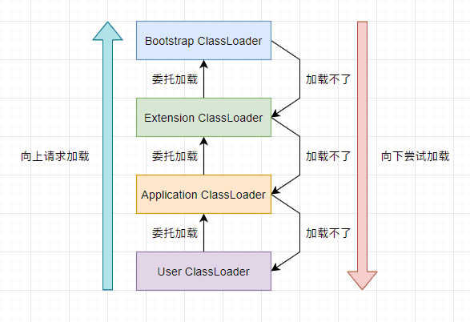

## 类加载

Java 虚拟机把描述类的数据从数据源（通常是 Class 文件）加载到内存，并对其校验、解析和初始化，最终生成 Java 可以使用的 Java 类型，这个过程被称为类加载。

### 类

在 Java 中类一般分为 4 种：普通类（以下均简称为类）、接口、数组类、泛型参数。其中由于 Java 会对泛型进行擦除，所以实际上到 JVM 中，类就只剩下前面三种。

在 Java 中数组类是由 JVM 直接生成的，而接口和类都需要从直接流中读取，当然这里的直接流不一定是来自 Class 文件的，也可以是生成的或者网络等其他环境。

### 流程

类加载的过程一般分为以下几步：

1. 加载
2. 链接
3. 初始化

#### 加载

**加载（Loading）**，就是把字节码从各种来源通过类加载器装载到 JVM 的过程。

字节码的来源有许多种，最常见的是通过 class 文件或者 jar 包中读取，也可以在 JVM 中生成（如数组类），或者从网络中加载。只要符合字节码的规范，同时类加载器支持的话就可以完成加载。当输入的数据不是 `ClassFile` 则会抛出 `ClassFormatError`。

#### 链接

**链接（Linking）**，就是将加载完成类合并到 JVM 中，使之可以被执行的过程。

链接有以下三个子步骤：

1. 验证
2. 准备
3. 解析

#### 验证

**验证（Verification）**，这是虚拟机安全的重要保障，JVM 需要核验字节信息是符合 Java 虚拟机规范的，这样就防止了恶意信息或者不合规的信息危害 JVM 的运行，验证阶段有可能触发更多 Class 的加载。

校验的过程大致分为 4 个部分：

1. 文件格式验证：校验字节流是否符合 Class 文件规范。验证内容包括是否以 `0xCAFEBABE` 魔数开头。主、次版本号是否在当前虚拟机的处理范围之内。常量池中的常量类型是否有不支持的。等等。
2. 元数据验证：对字节码描述的信息进行语义分析，以保证其描述的信息符合 Java 语言规范的要求。验证内容包括是否实现了接口，接口的方法是否都被实现了，是否继承自 `final` 标注的类等等。
3. 字节码验证：通过数据流和控制流分析，确定程序语义是合法的、符合逻辑的。验证的内容包括类型转换是否有效，跳转是否有效等等。
4. 符号引用验证：该验证在符号引用转换为直接引用的时候（解析阶段）进行校验，验证是否通过符号引用验证指向的实际引用是否有效。

#### 准备

**准备（Preparation）**，准备阶段则是为类的静态字段分配内存。除了分配内存外，部分虚拟机还会在此阶段构造其他跟类相关数据结构，如实现虚方法的动态绑定方法表。

比如定义以下的变量：

```java
class Demo {
    public static final int num1 = 1;
    public static int num2 = 1;
}
```

以上一个是静态变量，一个是静态常量，其中 `num1` 静态常量在编译时就确定了，其值存储于常量池中，在准备阶段赋值给 `num1`。而另一个 `num2` 静态变量，由于可以更改，所以无法确定值，所以是在 `clinit` 方法执行时赋值的。

#### 解析

**解析（Resolution）**，解析阶段就是将符号引用转换为实际引用。如果符号引用指向了一个未被加载的类，那么就会触发这个类的加载。

在 Java 虚拟机规范中，详细介绍了类、接口、方法和字段等各个方面的解析。

在 Class 文件未被加载进 JVM 的时候，JVM 并不知道这个类的方法、字段的地址，所以当需要引用这些未被加载的成员的时候，JVM 会生成一个**符号引用（Symbolic reference）**，用于代替实际引用。

比如对于一个方法调用，编译器会生成一个包含目标方法所在类的名字、目标方法的名字、接收参数类型以及返回值类型的符号引用，来指代所要调用的方法。

举个例子吧：


上面的字节码中第 3 行，可以看到其调用的是 `java/io/PrintStream.println ()V` 方法，这实际上是一个字符串，也就是符号引用，用于在实际使用前作为标识的作用。

当类被加载进 JVM 后，JVM 就不再需要符号引用来代替实际引用，而是直接将对应的类、字段、方法的地址作为引用，这就是**实际引用**。

#### 初始化

**初始化（Initialization）**，在初始化阶段，JVM 会执行类初始化的逻辑（静态字段赋值、执行静态代码段、父类的初始化）。当初始化完成后，类才算真正的变成可执行状态。

静态字段赋值、静态代码段这些操作会被 Java 编译器编译到构造方法中，JVM 在初始化的时候就执行这个方法，同时在执行该方法的过程中，JVM 会对其进行加锁来确保构造方法只被执行一次。

以下是一些常见的类初始化的时机：

- 当虚拟机启动时，初始化用户指定的主类；
- 当遇到用以新建目标类实例的 `new` 指令时，初始化 `new` 指令的目标类；
- 当遇到调用静态方法的指令时，初始化该静态方法所在的类；
- 当遇到访问静态字段的指令时，初始化该静态字段所在的类；
- 子类的初始化会触发父类的初始化；
- 如果一个接口定义了 `default` 方法，那么直接实现或者间接实现该接口的类的初始化，会触发该接口的初始化；
- 使用反射 API 对某个类进行[[反射调用]]时，初始化这个类；
- 当初次调用 `MethodHandle` 实例时，初始化该 `MethodHandle` 指向的方法所在的类。

## 类加载器

在 Java 中类加载器一般被分成以下 4 种：

- 启动类加载器（Bootstrap ClassLoader）
- 扩展类加载器（Extension ClassLoader）
- 应用程序类加载器（Application ClassLoader）
- 自定义类加载器



### 启动类加载器

该类加载器是采用 C/C++ 实现的，在 JVM 内部，所以 Java 程序无法操作这个类加载器。主要加载 Java 的核心类库，如 `rt.jar` 等，用于提供 JVM 运行所需的最基础类。

由于不是 Java 实现的，所以也没有继承自 `java.lang.ClassLoader` 一说，因为是最基础的类加载器，所以没有父类加载器。同时是扩展类加载器和应用程序类加载器的父类加载器。

### 扩展类加载器

从扩展类加载器开始就是使用 Java 语言实现的了，所以继承了 `java.lang.ClassLoader`，父类加载器是启动类加载器。主要加载 `java.ext.dirs` 目录下的类。

### 应用程序类加载器

和扩展类加载器类似，不过主要负责加载 `classpath` 里的类，也负责加载用户类。是 Java 程序中默认的加载器，我们写的类，依赖的类基本都是由应用程序类加载器加载的。

可以通过 `ClassLoader.getSystemClassLoader()` 获取这个类加载器。

### 自定义加载器

自定义加载器就是由我们自行实现的类加载器，通过继承 `java.lang.ClassLoader` 类，我们可以通过不同的方式不同的数据源中加载需要的类。

### 双亲委派机制

在 JVM 中，加载类的机制是采用双亲委派机制。当类加载器试图加载某个类型的时候，除非父加载器找不到相应类型，否则尽量将这个任务代理给当前加载器的父加载器去做，这个流程就是双亲委派模型。使用委派模型的目的是避免重复加载 Java 类型。

简单通俗的来讲就是，先把类加载的任务交给父加载器，父加载器做不到，那么子加载器才会取尝试加载，举个例子来说就是我想要买一个东西，我首先会先问问老爸能不能帮我买，如果可以，那么就不用我出钱了，如果不行，那就只能自掏腰包了。



### 破坏双亲委培机制

部分情况下也可能不是使用这种模型来加载，有的时候，启动类加载器所加载的类型，是可能要加载用户代码的，比如 JDK 内部的 `ServiceProvider/ServiceLoader` 机制，用户可以在标准 API 框架上，提供自己的实现，JDK 也需要提供些默认的参考实现。 例如，Java 中 JNDI、JDBC、文件系统、Cipher 等很多方面，都是利用的这种机制，这种情况就不会用双亲委派模型去加载，而是利用所谓的上下文加载器。

举一个例子吧：

```java
public class Demo {
    static {
        Connection connection = DriverManager.getConnection(url, username, password);
    }
}
```

这是 JDBC 用来获取数据库连接的一种方式，在 JDBC 4.0 之前需要使用 `Class.forName` 将对应的驱动加载进来，而在 JDBC 后可以利用 SPI 来进行加载。`DriverManager` 是启动类加载器加载的，启动类加载器只负责加载核心的类，所以数据库驱动需要子类加载器来完成加载，这就破坏了双亲委派机制。

除了这种情况还有一种是 Tomcat 的，Tomcat 的 `WebappClassLoader` 只会加载自己目录下的类，不会将其委派给父类加载器。之所以这么做其实挺简单的，通常我们使用 Tomcat 会部署不同的 Web 应用，不同的 Web 应用的类也不会一样，所以需要互相隔离，否则会导致出现问题。

## 结语

大致瞎写了一通，这篇文章大概也开坑了半个多月了，到现在才写完 🤣 ，主要也是在校一边要上课一边要写好多课后的作业，还要看看能不能找个好一点的暑假实习，所以挺忙的，有没有路过的大佬给个内推呢（逃。
