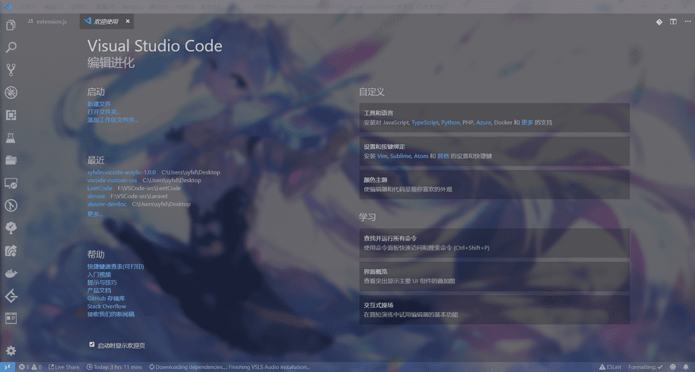

> 为 VSCode 添加 Acrylic 或者其他效果

## 前言

前几个星期一张带毛玻璃效果的 VSCode 的图片进入了我的视线，后来搜索了相关的设置教程发现只有 MacOS 才能启用这种效果，作为一个折腾青年，后来通过使用了[ewc](https://github.com/23phy/ewc)，VSCode 确实增加了 Acrylic 的效果，但是并不能使整个编辑器获得 Acrylic（第一次尝试是使用和 [GlassIt-VSC](https://github.com/hikarin522/GlassIt-VSC)一样的方式，即通过 JS 调用 Powershell 为 VSCode 窗口增加效果），可能是 CSS 没有写好，也可能是该方法不适用，反正最后放弃了折腾。直到昨天看到了 [vscode-vibrancy](https://github.com/EYHN/vscode-vibrancy) ，该扩展使用的是 Acrylic 效果，Acrylic 效果虽然美观但是会出现拖动延迟的问题，而 Blur 效果和 Acrylic 相近并不会产生拖动延迟，于是便打算将 [ewc](https://github.com/23phy/ewc) （支持 Acrylic 和 Blur 等效果）通过 [vscode-vibrancy](https://github.com/EYHN/vscode-vibrancy) 的方法加载进 VSCode，于是便有了这个扩展。

## 支持的系统

Windows10 ✔

## 使用方式

1. 安装该插件 [Visual Studio Code Marketplace](https://marketplace.visualstudio.com/items?itemName=syfxlin.vscode-acrylic)
2. 切换到任何的暗色主题，因为 Acrylic 效果和 Blur 效果在亮色主题下表现不佳
3. 按 F1 键运行“Enable Acrylic ”
4. 重启 VSCode

运行“Enable Acrylic”时 VSCode 应使用管理员权限运行

## 卸载方式

按 F1 键运行“Disable Acrylic ”

## FAQs

#### 为什么不支持 MacOS？

[vibrancy](https://github.com/EYHN/vscode-vibrancy)插件已经实现了 MacOS 下的 vibrancy 效果，没必要重复写插件，并且 MacOS 下的效果和 Windows 下的效果并不同。

#### 为什么要制作这个插件？

请看前言

## 相关链接

- [Visual Studio Code Marketplace](https://marketplace.visualstudio.com/items?itemName=syfxlin.vscode-acrylic)
- [Github](https://github.com/syfxlin/vscode-acrylic)
- [Introduction](https://blog.ixk.me/vscode-acrylic)

## Thinks

- [vscode-custom-css](https://github.com/be5invis/vscode-custom-css)
- [vscode-vibrancy](https://github.com/EYHN/vscode-vibrancy)
- [ewc](https://github.com/23phy/ewc)

## Render

#### Acrylic

#### BlurBehind

#### TransparentGradient

