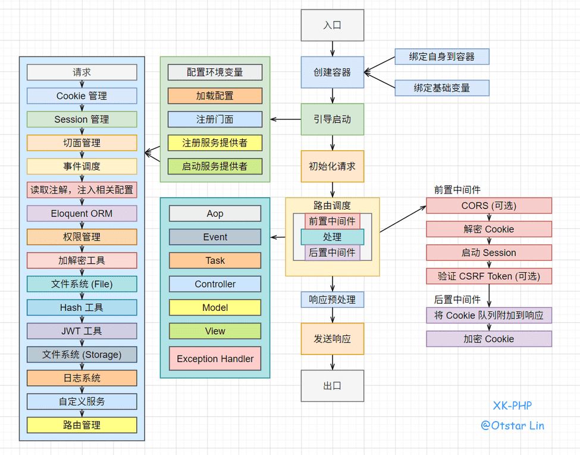

## 前言

前不久为了准备用 PHP（原本打算是用 Spring，但是还不太会 233） 写一个博客项目，因为不打算使用任何框架，于是便打算自己写一个应用模板来完成博客这个坑。由于之前用过 Laravel 并且很喜欢 Laravel 接口的风格，一开始打算是弄一个接口与 Laravel 类似的模板，所以就没有考虑到 PSR 相关的标准。后来由于博客项目暂时咕掉了 ?，而且 PHP 模板也逐渐完善便打算将其作为一个独立的项目来进行开发。

在开发的期间学习了许多有趣的功能和设计模式，看了不少 Laravel 的文章和源码（XK-PHP 有部分代码是基于 Laravel 缩水而来，当然也有不少添加了一些功能 ?）。

最近 XK-PHP 已经趋于完善，于是就打算把开发过程遇到的坑和学到的知识写成文章，做下记录顺便分享给有想了解框架如何实现的同学们。

本系列文章（没错，我要水好几篇文章 ?）主要是围绕着 XK-PHP 的实现过程展开，同时也会提及 Laravel 和 Swoft 等 PHP 框架的代码或问题。（预计可能会写好几个月

## 目录

1. [从零实现一个 PHP 微框架 - 前言](https://blog.ixk.me/implement-a-php-microframework-from-zero-1.html)
2. [从零实现一个 PHP 微框架 – PSR & Composer](https://blog.ixk.me/implement-a-php-microframework-from-zero-2.html)
3. [从零实现一个 PHP 微框架 – IoC 容器](https://blog.ixk.me/implement-a-php-microframework-from-zero-3.html)
4. [从零实现一个 PHP 微框架 – Bootstrap 启动加载](https://blog.ixk.me/implement-a-php-microframework-from-zero-4.html)
5. [从零实现一个 PHP 微框架 – 服务提供者](https://blog.ixk.me/implement-a-php-microframework-from-zero-5.html)

## Github 地址

目前 XK-PHP 大部分的功能均已完成，如果不想看文章的话也可以直接到 Github 上查看代码。

## 主要功能

- IoC 容器，兼容 PSR-11
- 中间件，兼容 PSR-15
- 请求和响应，兼容 PSR-7
- 注解
- Aop
- MVC
- Facade
- ReactJS 集成，类似于 Laravel Mix
- 简单事件系统
- 简单任务队列，类似于协程，但是是同步阻塞的，只是可以主动让出
- PHPUnit 单元测试，HTTP 测试
- 响应异常处理
- 日志系统
- 模板系统，类似于 Yii 的视图
- ......

## 流程图



## 框架成果

```php
<?php

namespace App\Controllers;

use ...

class HomeController
{
    /**
     * @var Request
     * @Autowired("App\Http\Request")
     */
    public $request;

    /**
     * @var Hash
     */
    public $hash;

    public function __construct(Hash $hash)
    {
        // 如果不使用注解注入类属性，则可以使用构造器注入
        $this->hash = $hash;
    }

    /**
     * @param Request $request
     * @param AnnotationReader $reader
     * @return View
     *
     * @DI\Set({
     *  @DI\Item(name="request", value="request")
     * })
     */
    public function index($request, AnnotationReader $reader): View
    {
        return view('home')->filter(function (string $content) {
            return preg_replace('/>(\s*)</', '><', $content);
        });
    }

    /**
     * @param Request $request
     * @return View
     * @Route\Get("/home/home")
     */
    public function home(Request $request): string
    {
        return view('home');
    }

    /**
     * @param Request $request
     * @return string
     *
     * @Route\Get("/jwt")
     */
    public function jwt(Request $request): string
    {
        return JWT::decode($request->query('jwt'));
    }

    /**
     * @param Request $request
     * @return bool
     */
    public function get(Request $request): bool
    {
        return true;
    }

    /**
     * @param Request $request
     * @return bool
     *
     * @Route\Get("/exce")
     */
    public function exception(Request $request): bool
    {
        Log::info('Info', 'Info', ['Info']);
        Log::debug('Debug', 'Debug', ['Debug']);
        Log::warn('Warn', 'Warn', ['Warn']);
        Log::error(new MethodNotAllowedException('Error'));
        Log::fatal(new MethodNotAllowedException('Fatal'));
        report('info', 'Info Function');
        abort(403);
        return true;
    }

    /**
     * @param int $path
     * @param int $query
     * @return string
     *
     * @Route\Get("/inject/{path}")
     */
    public function inject(int $path, int $query): string
    {
        // IoC 容器会自动将参数名作为 key 在绑定的实例和 Request 中寻找匹配的字段，然后进行注入
        return $path . ',' . $query;
    }

    /**
     * @return Response
     *
     * @Route\Get("/cookie")
     */
    public function cookie(): Response
    {
        $response = \response('Cookie')->cookie('cookie1', 'value');
        Cookie::queue(\App\Http\Cookie::make('cookie2', 'value'));
        return $response;
    }

    /**
     * @return string
     *
     * @Route\Get("/aspect")
     */
    public function aspect(): string
    {
        report('debug', 'hash');
        $hash = \App\Facades\Hash::make('123');
        report('debug', 'encrypt');
        $encrypt = App::callWithAspect(
            [Crypt::class, 'encrypt'],
            [
                'value' => '123'
            ]
        );
        report('debug', 'function');
        App::callWithAspect(
            function () {
                report('debug', 'function-in');
            },
            [],
            null,
            false,
            [LogAspect::class]
        );
        report('debug', App::make('path'));
        return '';
    }

    /**
     * @return string
     *
     * @Route\Get("/event")
     */
    public function event(): string
    {
        Event::dispatch('event.str_config');
        Event::listen(LogEvent::class, [LogListener::class, 'handle']);
        Event::subscribe(LogSubscriber::class);
        Event::dispatch(LogEvent::class);
        Event::listen('event.str', StrListener::class);
        Event::dispatch('event.str');
        return '';
    }

    /**
     * @return string
     *
     * @Route\Get("/task")
     */
    public function task(): string
    {
        $scheduler = new Scheduler();
        $req = function () {
            report('debug', 'task1-start');
            $ch = curl_init();
            curl_setopt($ch, CURLOPT_URL, "http://ixk.me");
            curl_setopt($ch, CURLOPT_RETURNTRANSFER, 1);
            $data = curl_exec($ch);
            curl_close($ch);
            report('debug', 'task1-end');
            return $data;
        };
        $task1 = function () use ($req) {
            for ($i = 0; $i < 5; $i++) {
                yield $req();
            }
        };
        $task2 = function () {
            for ($i = 0; $i < 5; $i++) {
                report('debug', 'task2-start');
                yield;
            }
        };
        $scheduler->add($task1);
        $scheduler->add($task2);
        $scheduler->then();
        return '';
    }
}
```

由于框架已经实现，所以我们就先看看结果吧。可以看到使用的方式和 Laravel 类似，当我们需要某些对象的时候，只需要在方法参数声明即可，IoC 容器会自动注入到方法中，也可以在构造器中或使用注解的方式注入到类中，同时也支持切面，日志，事件等功能。

## 结语

XK-PHP 参考了以下的框架：

- [Laravel](https://laravel.com/)
- [Swoft](https://www.swoft.org/)
- [Yii](https://www.yiiframework.com/)

感谢这些框架为我提供了实现和学习的思路。
