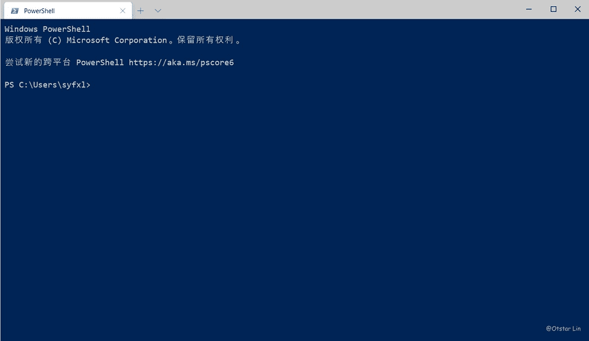
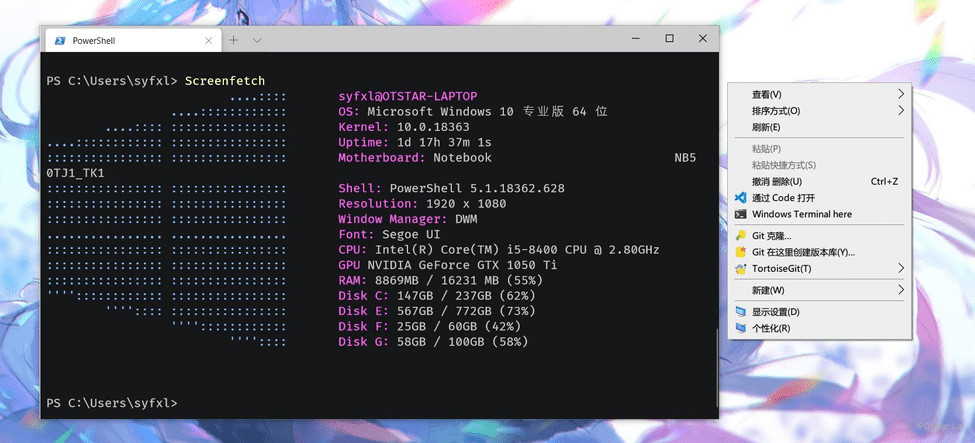
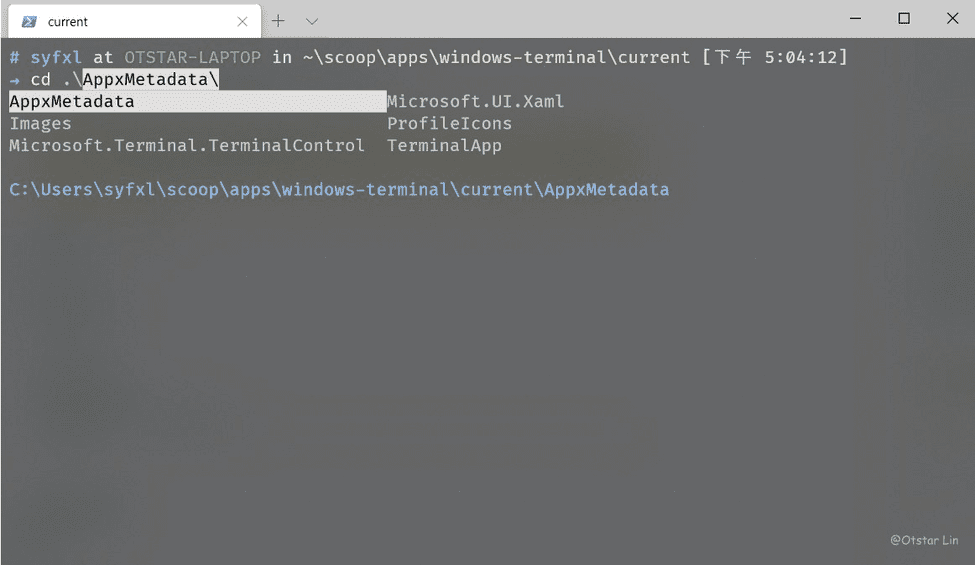
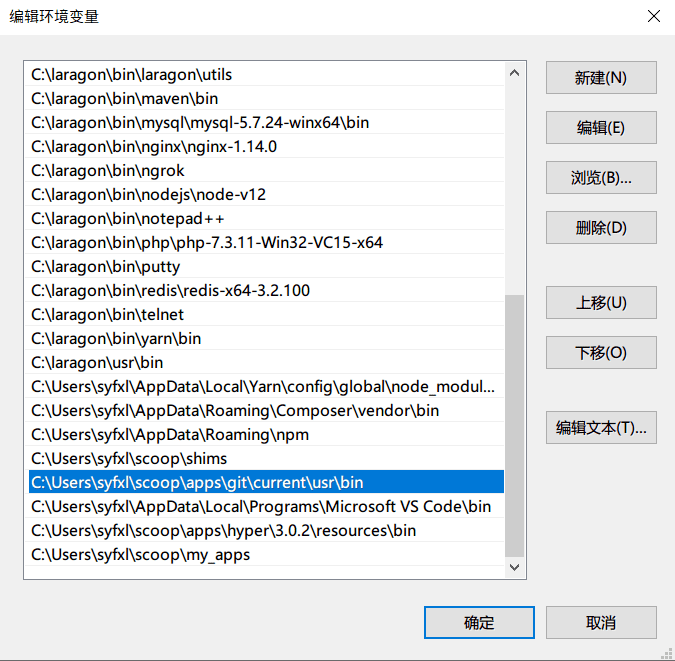
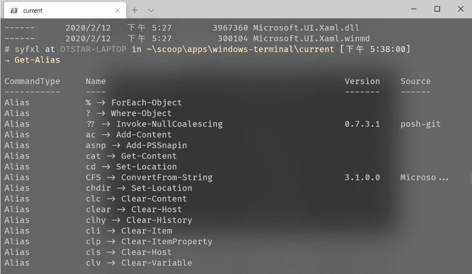
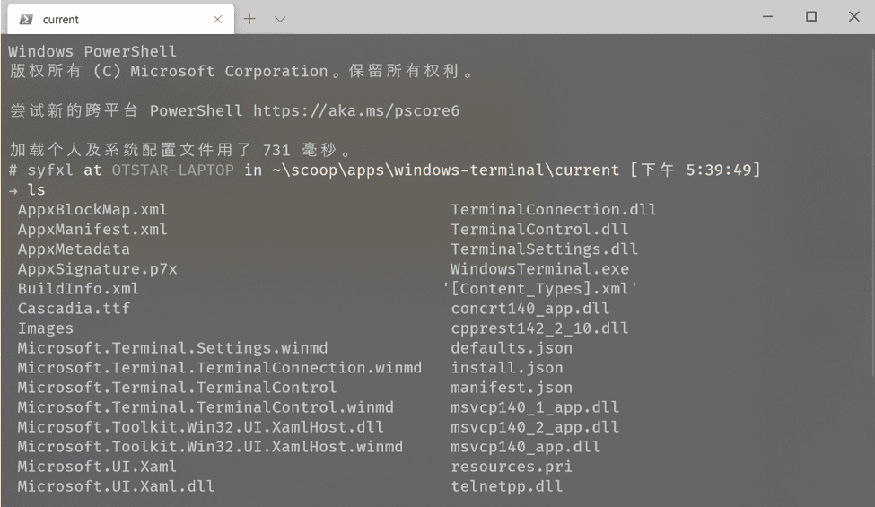

超长文和多图警告，流量少的同学和时间紧张的同学请注意 2333。

不知你有没有使用过 Linux 上的 oh-my-zsh？用过后你一定会惊叹，黑乎乎的终端也能变得这么好看，还有各式各样的的插件提升着终端的使用效率。不过，我们平常编程的时候一般是使用 Windows，那么 Windows 也能把 PowerShell 打造成 oh-my-zsh 的样子吗？是的，这是可行的，本文将会讲述如何打造好用好看的 PowerShell。(下图为 oh-my-zsh，使用 ys 主题


## 美化

有好的界面才能开心的使用命令行，正所谓颜值才是第一生产力（不是 (/▽＼)。

### 更换默认的 PowerShell 终端

首先，我们要把默认的 PowerShell 终端换掉，默认的终端又丑又伤眼，而且调整的空间较小，为了得到更好的效果，我们需要把默认的终端换掉。

博主推荐使用巨硬（微软）最新推出的 [Windows Terminal](https://github.com/microsoft/terminal)，虽然说设置相对麻烦（没有 UI），但是启动速度快，功能较为完整。当然你也可以使用其他终端，比如 [Fluent Terminal](https://github.com/felixse/FluentTerminal)，[Terminus](https://eugeny.github.io/terminus/) 或者 [Hyper](https://hyper.is/)。

安装 Windows Terminal 的方法很简单，直接到 [Microsoft Store](https://www.microsoft.com/en-us/p/windows-terminal-preview/9n0dx20hk701) 安装即可，本文采用 [Scoop](https://scoop.sh/) 来安装。

```powershell
scoop install windows-terminal
```

打开 Windows Terminal 我们可以看到其默认的样子：



是不是依旧很丑？别怕让我们来改造改造它。

### 配置 Windows Terminal

点击标签栏的下三角，我们可以看到 Settings 的选项，按住 Alt 然后点击它，就可以打开 Windows Terminal（以下简称 WT）的默认配置，然后松开 Alt 再次点击它，就可以打开我们需要修改的配置文件，注意不要改动 WT 的默认配置文件，如需覆盖默认配置只需要在个人配置文件中新增或修改即可。

下面我只会举例部分字段的使用，如需完整的设置项可以到官方文档查看：

- [Profiles.json Documentation](https://github.com/microsoft/terminal/blob/master/doc/cascadia/SettingsSchema.md)
- [Editing Windows Terminal JSON Settings](https://github.com/microsoft/terminal/blob/master/doc/user-docs/UsingJsonSettings.md)

#### 全局配置

```json
{
  // 如果 showTabsInTitlebar 与本值同为 false 时，自动隐藏标签栏
  "alwaysShowTabs": true,
  // 默认开启的终端 GUID
  "defaultProfile": "{61c54bbd-c2c6-5271-96e7-009a87ff44bf}",
  // 开启时的大小设置
  "initialCols": 120,
  "initialRows": 30,
  // 开启时的坐标，"x,y"
  "initialPosition": "500,250",
  // 主题风格，"light", "dark", "system"
  "requestedTheme": "system",
  // 合并标题栏和标签栏
  "showTabsInTitlebar": true,
  // 在标题栏上显示当前活动标签页的标题
  "showTerminalTitleInTitlebar": true,
  // 标签栏长度，"equal", "titleLength"
  "tabWidthMode": "equal",
  // 双击鼠标左键分词符
  "wordDelimiters": " /\\()\"'-.,:;<>~!@#$%^&*|+=[]{}~?\u2502",
  // 在关闭多个标签时是否弹出确认框
  "confirmCloseAllTabs": true,
  // 启动时最大化或窗口模式，"default", "maximized"
  "launchMode": "default"
  // ...
}
```

#### Profiles 配置

在新版 WT 中已经可以为所有的 Profile 设置默认配置，不需要再为每个 Profile 设置重复的配置了。

```json
{
  "profiles": {
    "defaults": {
      // ... 通用的默认配置，可以被 list 中个别的配置覆盖
    },
    "list": [
      // ... 不同的配置
    ]
  }
}
```

下面以 PowerShell 为例：

```json
{
  "profiles": {
    "defaults": {
      // Acrylic 效果
      "useAcrylic": true,
      "acrylicOpacity": 0.6,

      // 背景图片
      // "backgroundImage" : "...",
      // "backgroundImageOpacity" : 0.5,
      // "backgroundImageStretchMode" : "uniformToFill",

      // 配色主题
      "colorScheme": "Atom",
      // 光标颜色
      "cursorColor": "#FFFFFF",
      // 光标样式
      "cursorShape": "bar",

      // 字体设置
      "fontFace": "Fira Code Retina",
      "fontSize": 12,

      // 启动的目录，如果需要使用右键启动的话就设置 "."
      "startingDirectory": ".",
      // 显示滚动栏
      "scrollbarState": "visible"
    },
    "list": [
      {
        // 用于识别不同 Profile 的 GUID，可以在 PowerShell 使用 [guid]::NewGuid() 命令生成
        "guid": "{61c54bbd-c2c6-5271-96e7-009a87ff44bf}",
        // Profile 的名称
        "name": "PowerShell",
        // 启动命令行
        "commandline": "powershell.exe",
        // 图标
        "icon": "C:\\Users\\syfxl\\scoop\\my_data\\powershell.png",
        // 是否显示在列表中
        "hidden": false
      }
    ]
  }
}
```

把之前的 `defaultProfile` 设置为某个 Profile 的 GUID，打开 WT、新建标签页时就会默认使用这个 Profile。否则就需要使用 `+` 号旁边的 `下拉按钮` 来开启其他非 `hidden` 的 Profile。

#### 配色方案

WT 自带了一些配色方案，如果其中某个配色刚好是你喜欢的配色可以直接使用，WT 自带的配色有：`Campbell`、`Campbell Powershell`、`Vintage`、`One Half Dark`、`One Half Light`、`Solarized Dark`、`Solarized Light`。

如果这些配色你都不喜欢，那么就可以到这个仓库 [mbadolato/iTerm2-Color-Schemes](https://github.com/mbadolato/iTerm2-Color-Schemes/tree/master/windowsterminal) 下载你喜欢的配色。

```json
{
  "schemes": [
    {
      "name": "Atom",
      "black": "#000000",
      "red": "#fd5ff1",
      "green": "#87c38a",
      "yellow": "#ffd7b1",
      "blue": "#85befd",
      "purple": "#b9b6fc",
      "cyan": "#85befd",
      "white": "#e0e0e0",
      "brightBlack": "#000000",
      "brightRed": "#fd5ff1",
      "brightGreen": "#94fa36",
      "brightYellow": "#f5ffa8",
      "brightBlue": "#96cbfe",
      "brightPurple": "#b9b6fc",
      "brightCyan": "#85befd",
      "brightWhite": "#e0e0e0",
      "background": "#161719",
      "foreground": "#c5c8c6"
    }
  ]
}
```

#### 按键绑定

按键绑定这里就不写了，因为涉及到很多 `command` ，WT 自带的按键已经基本够用，如果有需要的可以到 WT 的文档中查看。

#### 右键菜单启动

很多时候我们需要在文档管理器中直接启动 WT，此时就需要添加一个右键菜单启动项了。

新建一个 bat 文件，填入以下内容（注意修改成你的配置），然后以管理员运行该 bat 即可。

```batch
@echo off

reg.exe add "HKEY_CLASSES_ROOT\Directory\Background\shell\wt" /f /ve /d "Windows Terminal here"
reg.exe add "HKEY_CLASSES_ROOT\Directory\Background\shell\wt" /f /v "Icon" /t REG_EXPAND_SZ /d "WT 图标路径"
reg.exe add "HKEY_CLASSES_ROOT\Directory\Background\shell\wt\command" /f /ve /t REG_EXPAND_SZ /d "\"WT.exe 的路径\""

pause
```

#### WT 部分小结

至此 WT 部分就配置完毕的了，大致的效果如下：



### oh-my-posh

光有 WT 肯定是不够的，使用一下你会发现，也就主题的颜色变了，外表变了，字体好看了，终端很多字符都还是白色，并没有像 oh-my-zsh 那么色彩斑斓。本节就来改造下 PowerShell（以下简称 Posh）。

zsh 下有 oh-my-zsh，Posh 下也有 oh-my-posh 可以做到和 oh-my-zsh 一样的外观。

本文一样采用 Scoop 来安装 oh-my-posh，同时也提供了 Posh 默认的方式安装。

```powershell
# Scoop 安装
scoop install posh-git
scoop install oh-my-posh
scoop install posh-docker

# 默认安装
Install-Module posh-git -Scope CurrentUser
Install-Module oh-my-posh -Scope CurrentUser
Install-Module posh-docker -Scope CurrentUser
```

安装完后，我们还需要配置下 Posh 才能使其变成 oh-my-zsh 的样子。

首先在 Posh 中输入 `$profile` 并回车，Posh 会输出你当前使用的 Profile 文件地址，打开该文件（若没有就需要新建），在该文件中写入以下内容。

```powershell
Import-Module posh-git
Import-Module posh-docker
Import-Module oh-my-posh
# 设置主题，博主用的是 Honukai
Set-Theme Honukai
```

重新启动后，你就会发现终端的样式变了几乎和 oh-my-zsh 的外观一样了，并且也有 git 状态的提示了：


注意：部分主题需要使用到 PowerLine 字体才能正确显示，若你要使用这些主题，请安装 PowerLine 字体并将 WT 的字体设置成 PowerLine 字体。

## 功能

光有好看的外表可不行，还要实用才行，oh-my-zsh 中有很多插件可以增强 zsh 的功能，其中如 zsh-syntax-highlighting，zsh-autosuggestions 等，zsh-syntax-highlighting 的功能 oh-my-posh 已经可以实现了，但是能够极大提高效率的 zsh-autosuggestions，Posh 有没有类似的实现？答案是有的，PSReadLine，这个插件早就默认集成在了 Posh 中，只是该插件需要配置才能使用，而该插件就可以做到和 zsh-autosuggestions 或 fish 的自动查找历史记录并填充的效果。

### PSReadLine

#### 配置

PSReadLine 的配置较为麻烦，但是官方已经提供好了 [样例](https://github.com/PowerShell/PSReadLine/blob/master/PSReadLine/SamplePSReadLineProfile.ps1) 可以直接白嫖使用。

直接将样例配置复制到 `$profile` 文件中即可。

然后在 `Import-Module PSReadLine` 下增加一行：

```powershell
# 设置类似于Bash的菜单选择功能
Set-PSReadlineKeyHandler -Key Tab -Function MenuComplete
```

#### 使用介绍

首先是类 Bash 选择菜单，输入命令的时候按下 `Tab` 键触发，再次按 `Tab` 可以在菜单中进行选择，如下：



然后是类似于 zsh-autosuggestions 和 fish 的历史记录搜索和补全，输入一半命令后可以通过上下键进行选择与前缀相匹配的历史记录：


其他功能还有右引号和右括号自动补全等功能，需要的可以自行查看样例配置中的注释自行尝试即可，功能很全面。

### Git Bash 工具包

有了一些增强功能，不过 Linux 终端的强大并不只有这些，还有其好用的 GNU 工具，虽然说 Windows 大多情况下可以用一些其他工具来做到和 GNU 工具一样的效果，但是偶尔也可能会用到这些 GNU 功能，那么 Windows 要如何安装使用这些工具呢？

Windows 上的 GNU 工具可以有很多方式来安装，比如 Cygwin，MSYS2，Git Bash，CoreUtils 等等，但是这里推荐直接使用 Git Bash 的即可，因为不需要在安装 Git 后多安装一套工具。

可是 Git 的 GNU 工具不是给 Git Bash 用的吗？Posh 要如何使用这些工具？如果你看过 Git 的 `usr\bin` 目录你就知道了，这些 GNU 工具都是 `exe` 可执行文件，Posh 完全可以直接运行这些工具。要在 Posh 下使用这个工具，只需要将 Git 的 `usr\bin` 目录添加到 PATH 中即可。



可是当你设置完后实际运行下你会发现，似乎并没有用，Posh 还是运行了 Posh 的命令


这其实是命令别名把 GNU 的工具命令覆盖了导致的，我们只需要删除这些 Posh 自带的命令别名即可。

利用 `Get-Alias` 命令就可以查看 Posh 中设置那些命令别名，这样我们就可以很方便的找出冲突的命令，并取消对应的命令别名。



找出冲突的别名后就可以用 `Remove-Item alias:\<command>` 删除命令别名了，比如我删除了以下的命令别名：

```powershell
Remove-Item alias:\curl
Remove-Item alias:\wget
Remove-Item alias:\rm
Remove-Item alias:\ls
Remove-Item alias:\cp
```

再次运行 Posh 你就会发现被覆盖的 GNU 工具可以正常使用了



不过需要注意下，Git Bash 的 GNU 工具中并没有 wget，如果要使用 wget 可以另外下载安装，这里就不写了。

## 结语

完整的配置文件已放到了 Gist 中你可以参照我的配置文件修改使用：[windows-terminal-profile.json](https://gist.github.com/syfxlin/0214ea1c78d50e72edb83c218e1e02cb) [posh-profile.ps1](https://gist.github.com/syfxlin/3930bcf79465f0bde4b68cea6e2dfab0)

又是一篇长文，肝了一个下午，总算把 Windows 终端的配置给讲完了，写这篇的目的有两个，一个是给直接的踩坑留下记录，方便以后重装系统之类的使用，二是希望受 Windows 终端使用苦恼的同学们一点微小的帮助。

其实 Posh 还是很好用的，甚至比 zsh bash fish 等命令行好用，只是生态没有这些好，社区中好用的工具插件不如这些命令行多。\[\]~(￣ ▽ ￣)~\*
