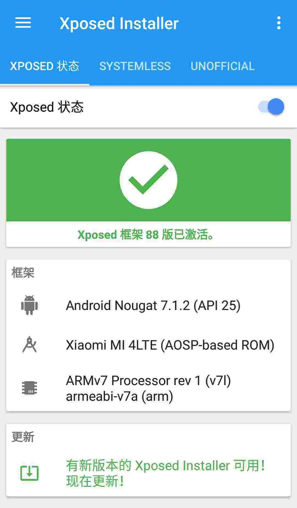
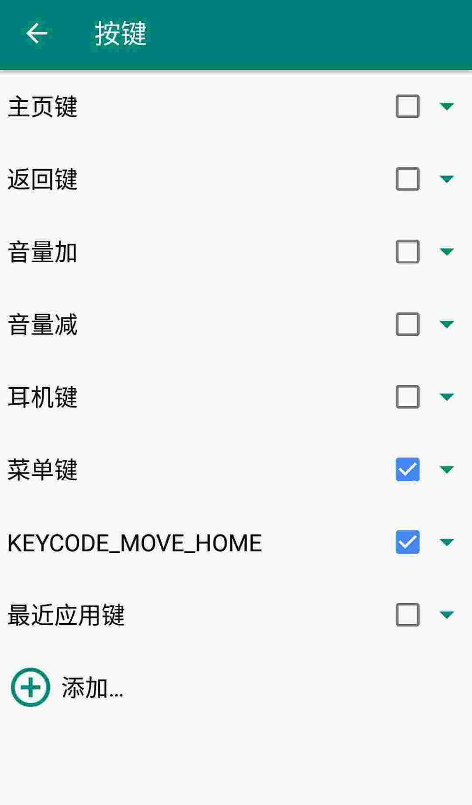
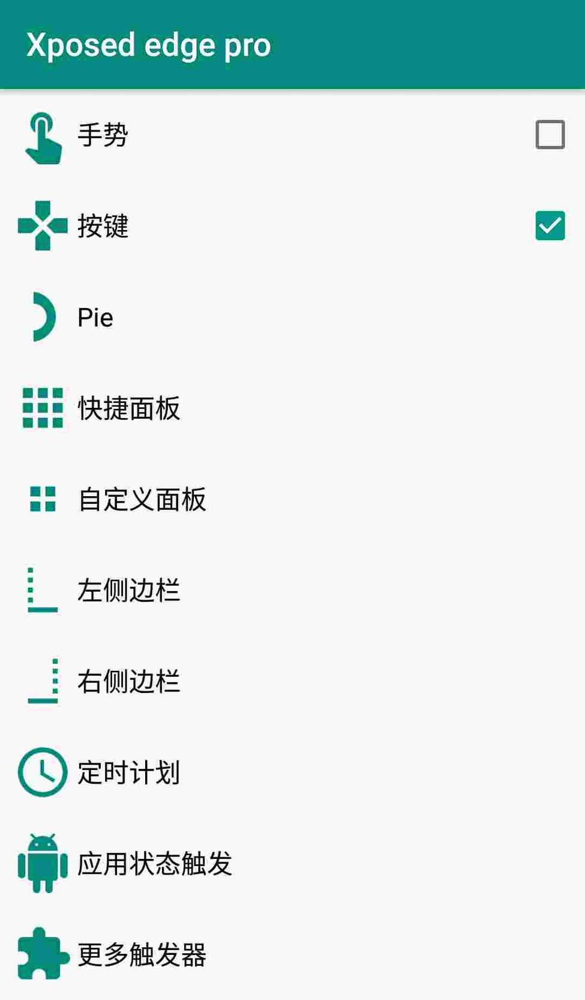

> 大家都知道小米的原装屏幕很贵，其实是因为触控芯片贵，所以有些商家就弄出了“非原装芯片”，也使小米手机用户不再心疼屏幕碎了，但是这也带来了一些问题，由于非原装芯片只对 MIUI 系统设计，所以刷第三方 rom 就会遇到按键出错的问题。

由于我前一部手机 z90 疯狂闪退，入手二手小米 4，刷入第三方 rom 后发现按键出错，经过不懈搜索我终于找到可以改键的 xposed 模块（其实我早就在使用\_(:з」∠)\_）

# 教程开始

下载 xposed 框架安装，激活 xposed edge pro 模块，重启

进入 xposed edge 软件，勾选按键

点击按键，进入按键设置菜单，我的是小米 4，底部最近任务键被映射到菜单键，主页键被映射到跳转顶部键，一波调教后按键恢复正常

这种方法支持所有手机，前提是要能激活 xposed 并正常使用，另外 Android8.0 还没有框架，所以要想改键的话还是放弃 8.0 吧。
