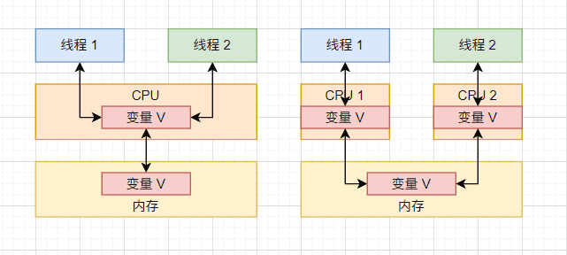
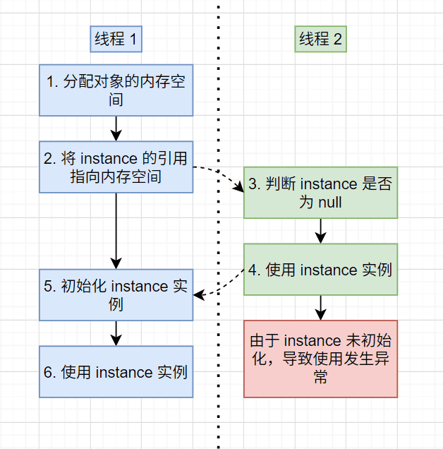

## 前言

好久没写并发相关的文章了，之所以一直没写是因为我也是半桶水水平，一直写不出来，最近使用了 [Obsidian](https://obsidian.md/) 来记笔记（之前一直没笔记习惯，学了就忘了，所以打算用一款好的软件尝试下），积累了一些笔记，便打算通过写文章加深下，顺便看看这种 [卡片式笔记法](https://en.wikipedia.org/wiki/Zettelkasten) 对整理思路的是否有帮助。

## 可见性

**可见性** 指的是一个主内存的线程如果进行了修改，可以及时被其他线程观察到。

### 可见性问题产生的原因

**缓存**导致了可见性问题，在 Java 中所有变量都储存在**主内存**中，- 每个线程都有自己**独立的工作内存**（缓存、寄存器等），里面保存该线程使用到的变量的副本（主内存中该变量的一份拷贝），线程对共享变量所有的操作都必须在自己的工作内存中进行，不能直接从主内存中读写，不同线程之间也无法直接访问其他线程的工作内存中的变量，线程间变量值的传递需要通过主内存来进行。



### 样例

```java
private boolean stop = false;

public void stop() {
	stop = true;
}

public void loop() {
	while (!stop) {
		// do something
	}
}
```

### 问题产生

以上代码在运行前，各线程会先将 `stop` 值复制到自己的工作内存中，当线程 1 进入 `loop` 的循环的时候该线程会一直从自己的工作内存读取值，并不会再从主内存读取值。这样就造成了一个问题，如果 `stop` 方法不是线程 1 调用的，那么线程 1 读取到的值则会一直为 `false` 造成死循环的发生。

### 解决方案

- volatile
- synchronized

对于可见性问题，我们可以为 `stop` 变量**加上 `volatile` 关键字**，这样线程 1 每次都会到主内存读取 `stop` 值，其他线程更新时也会立即更新到主内存，这样就可以及时停止死循环。

`volatile` 通过加入内存屏障和禁止重排序优化来实现。对 `volatile` 变量写操作时，会在写操作后加入一条 `store` 屏障指令，将本地内存中的共享变量值刷新到主内存。对 `volatile` 变量读操作时，会在读操作前加入一条 `load` 屏障指令，从主内存中读取共享变量。

```java
private volatile boolean stop = false;

public void stop() {
	stop = true;
}

public void loop() {
	while (!stop) {
		// do something
	}
}
```

除了 `volatile` 关键字，我们还可以使用 `synchronized` 加锁。这是因为线程解锁前，必须把共享变量的最新值刷新到主内存。线程加锁时，将清空工作内存中共享变量的值，从而使用共享变量时需要从主内存重新读取最新的值。

> 完整样例：[可见性 & 原子性问题及解决](https://github.com/syfxlin/code/tree/master/100-days-of-code/java/src/main/java/me/ixk/days/day10)

## 有序性

**有序性**指的是程序按照代码的先后顺序执行。

### 有序性问题产生的原因

**指令重排**导致了有序性问题，Java 内存模型中，允许编译器和处理器对指令进行重排序，但是重排序过程不会影响到单线程程序的执行，却会影响到多线程并发执行的正确性。

### 样例

```java
public class Singleton {

  static Singleton instance;

  static Singleton getInstance() {
    if (instance == null) {
      synchronized (Singleton.class) {
        if (instance == null) {
          instance = new Singleton();
        }
      }
    }
    return instance;
  }
}
```

### 问题产生

未进行指令重排的情况下，`instance = new Singleton()` 的执行顺序如下：

1. 分配一块内存 M
2. 在内存 M 上初始化 `Singleton` 对象
3. 然后 M 的地址赋值给 `instance` 变量

然而编译器**有可能**进行以下的指令重排，重排后的顺序如下：

1. 分配一块内存 M
2. 将 M 的地址赋值给 `instance` 变量
3. 然后在内存 M 上初始化 `Singleton` 对象

当指令重排后，线程 1 `instance = new Singleton()` 执行完 2 步骤后，此时进行线程切换，线程 2 `getInstance()` 当走到 `if (instance == null)` 的时候，由于 `instance` 变量已经被赋值了，那么就获取成功，返回，但是此时 `Singleton` 对象并未初始化，如果这时候使用该对象，那么就会导致抛出 NPE 异常。



### 解决方案

- volatile
- synchronized

将 `instance` 变量加上 `volatile` 关键字禁用指令重排即可。

```java
public class Singleton {

  static volatile Singleton instance;

  static Singleton getInstance() {
    if (instance == null) {
      synchronized (Singleton.class) {
        if (instance == null) {
          instance = new Singleton();
        }
      }
    }
    return instance;
  }
}
```

## 原子性

**原子性**指提供互斥访问，同一时刻只能有一个线程对数据进行操作。简单来说就是序列化的执行。

### 问题原因

**线程切换**导致原子性问题，Java 并发程序都是基于多线程的，操作系统为了充分利用 CPU 的资源，将 CPU 分成若干个时间片，在多线程环境下，线程会被操作系统调度进行任务切换。

### 样例

```java
private int count = 0; //1

public void add() {
    count++; // 2
}

public int get() {
    return count; // 3
}
```

### 问题产生

以上的代码除了 1 是原子操作，其他均不是原子操作。

其实语句 2 在执行的时候，包含三个指令操作：

1. 将 `count` 的值加载到 CPU 的寄存器
2. 进行 +1 操作
3. 将计算结果写入到 `count` 内存中

对于上面的三条指令来说，如果线程 1 在 1 执行完后做线程切换，线程 1 和线程 2 按照下图的序列执行，那么我们会发现两个线程都执行了 `count+=1` 的操作，但是得到的结果不是我们期望的 2，而是 1。


### 解决方案

- Atomic
- CAS
- synchronized
- Lock

对原子性不安全的地方进行**加锁操作**、**使用原子操作类**、**CAS** 等方法即可解决原子性的问题。如样例的代码经过如下改动即可实现线程安全：

```java
private int count = 0; //1

public synchronized void add() {
    count++; // 2
}

public synchronized int get() {
    return count; // 3
}
```

当然对于这种累加的操作我们最好还是使用对应的原子类，如 `int` 对应 `AtomicInteger`。

> 完整样例：[可见性 & 原子性问题及解决](https://github.com/syfxlin/code/tree/master/100-days-of-code/java/src/main/java/me/ixk/days/day10)

## 结语

到此这篇文章就结束了，虽说我们了解了这些问题产生的原因和解决方案，但是在实际的编码过程中，并发问题往往都很隐蔽，不容易发现和修正。除了隐蔽外，并发编程也存在着心智负担，我们通常很难决定是要使用那种同步方式来防止线程不安全的情况发生，比如我在写框架的时候就经常遇到是要暴力加锁还是用 CAS 或者并发容器，是要弱一致性还是要强一致性。

如果您发现了文章的错误欢迎留言纠正。
