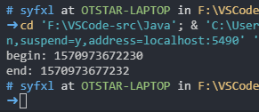
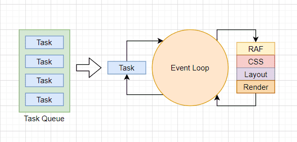

更新此篇文章的原因是看到一个 JSConf 关于事件循环的演讲，建议有能力的（能上 YouTube）看看这个演讲。

[Jake Archibald: 在循环 - JSConf.Asia](https://www.youtube.com/watch?v=cCOL7MC4Pl0)

## 什么是 Event Loop？

若你了解过 JavaScript，你一定知道 JavaScript 是一种**单线程语言**，为什么 JavaScript 是单线程呢？为什么不使用多线程呢？JavaScript 作为浏览器脚本语言（虽然现在也在后端挺流行的），JavaScript 的**主要用途是与用户互动**，**以及操作 DOM**。若使用多线程就会导致一些问题，比如**更新丢失等问题**，当一个线程要删除 DOM 的时候另一个线程要更改它，那浏览器该如何操作呢。所以 JavaScript 为了避免多线程带来的一系列问题采用了单线程的运行机制。

而若只是单纯的同步单线程的执行便会导致 JS 运行到某个需要等待的位置时就会造成**假死状态**，比如当 JS 要从网络中获取一张巨大的图片，发起了 HTTP 请求，在等待 HTTP 请求中若是不采用某种机制来处理的话就会导致卡住的假死状态，我们可以用 Java 来模拟一下:

```java
import java.util.Date;

public class Main {
   public static void main(String[] args) {
      // 打印该句执行的时间
      System.out.println("begin: " + new Date().getTime());
      try {
         // 利用sleep模拟请求时的状态
         Thread.sleep(5000);
      } catch (InterruptedException e) {
         e.printStackTrace();
      }
      // 打印该句执行的时间
      System.out.println("end: " + new Date().getTime());
   }
}
```



从上面的运行结果可以看到，同步运行的时候 Java 在 begin 和 end 中间隔了非常久的时间，程序也在那时候**被阻塞住了**，而 UI 是不能被阻塞的否则会严重影响用户体验，所以 JS 采用**异步**来防止这种情况发生。

当 JS 线程执行到需要**异步**的操作的时候就会把该任务发到**任务队列**，然后继续向下执行，当所有的**同步代码都执行完毕**的时候，JS 线程就会从任务队列读取任务并执行，若遇到异步操作就继续**入队**。。。如此往复，这就是**Event Loop(事件循环)**。



## Task

在浏览器中存在着一个**任务队列**，如上图，左侧绿色的部分，任务队列中存放着将要执行的任务，当任务队列中没有任务的时候，事件循环会进入**空转**的状态，但这并不代表浏览器是休眠的，从上图我们可以看到，除了任务队列外，事件循环还要处理**渲染相关的任务**。一旦有任务进入任务队列了，浏览器会在可以执行任务的时机从任务队列中取出任务并执行，**执行完一个任务后就进入下一个循环**，而不是逐个取出任务执行直到任务队列为空。

为了容易理解 **Task**，我们通常把 **Task** 分成 **MacroTask (宏任务)** 和 **MicroTask (微任务)**，宏任务很好理解，就是一些异步的任务，如 `setTimeout` 等等，而微任务比较常见的就是 `Promise`。微任务会在宏任务执行完后，并且 JS 调用栈为空的时候执行。具体的过程下面会分析。

## Promise

**Promise** 是 ES6 新增的一种异步解决方案，它的运行方式是当需要进行 I/O，等待等异步操作的时候，不返回结果而是返回一个 **Promise（"承诺"）**，当这个承诺完成的时候，即状态变为 `fulfilled` 或者 `rejected` ，这个 promise 就定格了，也可以认为返回值是一样的了，你可以在任何位置任何时间利用 `then` 得到这个结果（返回值），或许这有点难以理解，那就举个例子吧：

```javascript
var re = "foo";

var promise1 = new Promise(function (resolve, reject) {
  setTimeout(function () {
    resolve(re);
  }, 300);
});

promise1.then(function (value) {
  console.log("one call value: " + value);
  console.log("one vall re prev: " + re);
  re = "foo2";
  console.log("one call re: " + re);
});

promise1.then(function (value) {
  console.log("two call value: " + value);
  console.log("two call re: " + re);
});

console.log(promise1);

// > [object Promise]
// > "one call value: foo"
// > "one vall re prev: foo"
// > "one call re: foo2"
// > "two call value: foo"
// > "two call re: foo2"
```

运行重置输入

从上面的运行结果可以看到 re 确实在第一次调用 promise1 的时候被修改为 foo2，但是当第二次调用 promise 时的 value 并没有跟着改变，也就是说 promise 不会再调用第二次，而是直接返回结果。

## async/await

ES7 中添加了 `async` 和 `await` 的关键字，`async` 返回的必定是 Promise，可以理解为就是异步函数，`await` 是等待 Promise。

`async` 可以使一个函数成为异步函数，返回 Promise，我们可以把 async 认为使`new Promise` 的语法糖，所以当函数 `return` 值的时候 **return 的不是值而是 Promise**，若要得到 `async` 中 return 的值就需要使用 `then`。

```javascript
var fun = async function foo() {
  return "hello";
};

var re = fun();
console.log(re);
re.then((value) => console.log(value));

// > [object Promise]
// > "hello"
```

运行重置输入

`await` 是等待后面东西，可以是 Promise，可以是值，可以是表达式，当可以直接得到值的时候 `await` 会立即返回值，但若是 Promise，`await` 就会将 JS 阻塞住，直到 Promise 兑现，有了 `await`，我们可以把异步的 JS 写成同步的 JS，可以有效的解决回调地狱。

## 一个有用的例子

```javascript
console.log("sync1");

setTimeout(function () {
  //1
  console.log("sync_timeout1");
}, 0);

var promise = new Promise(function (resolve, reject) {
  setTimeout(function () {
    //2
    console.log("pro_new_timeout");
  }, 0);
  console.log("pro_new");
  resolve();
});

promise.then(() => {
  console.log("pro_then");
  setTimeout(() => {
    //3
    console.log("pro_timeout");
  }, 0);
});

setTimeout(function () {
  //4
  console.log("sync_timeout2");
}, 0);
console.log("sync2");
```

运行重置输入

看到这个代码，是不是很晕，先不要放到 JS 中运行，让我们一起来看看这个的输出，你可以先不看以下的步骤自己思考一下，或许能得到不小收获。

首先，sync1 的 console.log 肯定是第一个输出的，调用栈先进了 console，然后出栈，控制台输出`sync1`

然后程序来到了第一个 setTimeout，这是一个异步宏任务，所以放到宏任务队列中，然后跳过该 setTimeout。MacroTask Queue:\[setTimeout-1\]

接下来程序来到了 new promise，new promise 是同步的，所以会进入到 function 中，遇到第二个 setTimeout，此时将这个 setTimeout 放到宏任务队列中，然后跳过 setTimeout，执行到 console.log，输出`pro_new`，接着遇到 resolve，是微任务将其放到微任务队列中，然后退出 function。MacroTask Queue:\[setTimeout-1,setTimeout-2\]，MicroTask Queue:\[resolve\]

接着遇到了 promise 的 then，这是属于 resolve 的回调，当 resolve 状态改变的时候才执行，所以跳过该部分。MacroTask Queue:\[setTimeout-1,setTimeout-2\]，MicroTask Queue:\[resolve\]

然后又遇到了一个 setTimeout，同样将其放到宏任务队列中。MacroTask Queue:\[setTimeout-1,setTimeout-2,setTimeout-4\]，MicroTask Queue:\[resolve\]

接着遇到了最后一个 console.log，输出`sync2`，此时同步代码已经执行完毕。

微任务列表不为空，所以需要在这个 tick 中执行，不能先取宏任务，调用 resolve 的 then，输出`pro_then`，同时将 setTimeout 放入宏任务队列。MacroTask Queue:\[setTimeout-1,setTimeout-2,setTimeout-4,setTimeout-3\]，MicroTask Queue:\[\]

微任务队列空了，从宏任务中取出队首的任务，即 setTimeout-1，执行后输出`sync_timeout1`

取出队首任务，setTimeout-2，输出`pro_new_timeout`

取出队首任务，setTimeout-4，输出`sync_timeout2`

取出队首任务，setTimeout-3，输出`pro_timeout`，此时宏任务列表和微任务队列为空，js 引擎进入等待状态。

- sync1
- pro_new
- sync2
- pro_then
- sync_timeout1
- pro_new_timeout
- sync_timeout2
- pro_timeout

你们猜对了吗？反正我第一次是没猜对（逃

## 一些值得了解的地方

很多文章会把 Task 分成 **MacroTask 和 MicroTask**，并说明 **MicroTask 是在 MacroTask 的末尾执行完毕**，其实这并不准确。我们来看看以下代码：

```javascript
button.addEventListener("click", () => {
  Promise.resolve().then(() => console.log("Microtask 1"));
  console.log("Listener 1");
});
button.addEventListener("click", () => {
  Promise.resolve().then(() => console.log("Microtask 2"));
  console.log("Listener 2");
});
```

代码很简单，为一个按钮注册两个点击事件，当用户点击后，控制台会输出一些日志：

- Listener 1
- Microtask 1
- Listener 2
- Microtask 2

按照微任务在宏任务完成后执行的流程，对照这输出，似乎并没有错误，但是，如果我们**手动触发点击事件**会如何呢？

```javascript
button.addEventListener("click", () => {
  Promise.resolve().then(() => console.log("Microtask 1"));
  console.log("Listener 1");
});
button.addEventListener("click", () => {
  Promise.resolve().then(() => console.log("Microtask 2"));
  console.log("Listener 2");
});
button.click();
```

此时的输出就变成了：

- Listener 1
- Listener 2
- Microtask 1
- Microtask 2

从以上输出可以看到，微任务一定会在该宏任务下执行完毕的说法是**错误的**，那么，是什么原因造成二者的差异呢？其实，这是就是我在 Task 章节里说到的，**微任务会在宏任务执行完后并且 JS 调用栈为空的时候执行**。在第二段代码中，执行完 Listener 1 宏任务的时候，JS 调用栈还存在着 `button.click()` 这个函数的栈帧，所以 Microtask 1 微任务就无法被执行，直到 Listener 2 完成的时候，`button.click()` 函数调用帧才会出栈，此时 JS 调用栈才为空，微任务才可开始执行，所以就有了以上的输出。

## 结语

学了好久的前端，之前对异步只处于会用的状态，前几天刚了解了一下 JS 的异步，刚好好久没写过文章了，便自己整理了写成一篇文章，输出才是最好的学习，其实是为了水文章（逃。(￣ y▽,￣)╭
