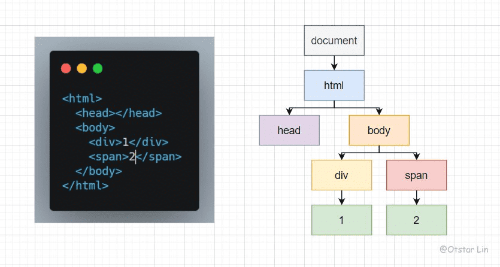
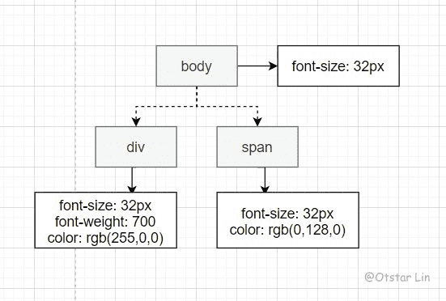
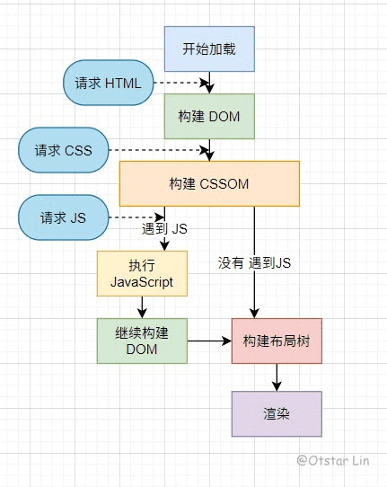

> 好久没写理论性较强的文章了。最近刚好正在了解浏览器的工作原理，于是打算写一篇文章来加强下，输出才是最好的输入嘛 hhhh。

## 什么是渲染？

在计算机图形学的领域 `渲染` 是 `render` 的翻译，看到这个词，写过 React 的开发者应该很熟悉，在 React 中 render 函数做的是将 `数据` 变成 `HTML 代码` 的工作。而在图形学中 render 指的是由 `模型` 生成 `图像` 的过程，同理在浏览器中 render 做的就是将 DOM 绘制成我们可以看到的 网页。

在谈真正的 `渲染` 之前，我们需要先了解 `布局树` 是如何生成的，有助于更好的了解后续的渲染过程。

## 加载

当用户开始访问一个页面的时候，浏览器就会向服务器请求资源，当网络进程从服务器获取到数据的时候，就会将数据发给渲染进程的 HTML 解析器进行解析，这个过程是实时的，也就是说**网络进程收到多少数据，HTML 解析器就解析多少数据，而不会等网络进程收到所有数据后才解析 HTML**。

## 解析

### DOM

当渲染进程收到 `HTML 字节流` 的时候，就会调用 `HTMLParser` 把 HTML 解析成 DOM 树，具体流程见下图：

渲染进程收到字节流时会根据指定编码（UTF-8 等）把字节流转换成字符串，也就是我们写的代码。而渲染引擎是**无法直接理解和使用代码的**，所以需要将 HTML **转换为浏览器能理解的结构，即 DOM 树**。

要将 HTML 转换成 DOM 树还要经过词法分析，将 HTML 转换为 `Tag Token` 和 `文本 Token`，例子如下：

分词完成后，就需要将 Token 解析成 DOM 节点，并将其添加到 DOM 树中，解析的过程这里就不写了，最终生成的 DOM 树如下所示：

### CSSOM

和 HTML 一样，渲染引擎也是**无法直接理解和使用 CSS 的所以需要将其解析成渲染引擎能够理解的结构，这个结构就是 CSSOM**。浏览器解析 CSS 文件并生成 CSS 规则树，每个 CSS 文件都被分析成一个 `StyleSheet 对象`，每个对象都包含 CSS 规则。CSS 规则对象包含对应于 CSS 语法的选择器和声明对象以及其他对象。

当 CSS 转换成浏览器可以理解的结构的时候，那么接下来就要对其属性值进行标准化操作。CSS 中一般都有各种各样的单位，如 `rem em blue bold` 等，这些类型数值不容易被渲染引擎理解，所以需要**将所有值转换为渲染引擎容易理解的、标准化的计算值，这个过程就是属性值标准化**。具体样例见下图：

样式已经标准化了，下一步就是计算 DOM 树各个节点的样式和属性了。

首先是**继承**，CSS 中部分样式是可以被子元素继承的，这些可以继承的属性应该同时添加到子元素的样式中。然后是**层叠**，层叠是 CSS 的一个基本特征，它是定义了如何合并多个不同来源的样式的算法。CSS 的全称即层叠样式表即说明了层叠这个特性在 CSS 中的重要地位。

最终生成的 CSSOM 如下：

### 布局树

有了渲染引擎可以理解的 `DOM 树` 和 `CSSOM 树`，就可构造成最终要绘制的布局树了。

为了构建布局树，浏览器大体上完成了下面这些工作：

- 遍历 DOM 树中的所有可见节点，并把这些节点加到布局中；
- **而不可见的节点会被布局树忽略掉**，如 head 标签下面的全部内容，再比如属性包含 dispaly:none 的元素等等。

### 布局计算 & 分层

此时，渲染引擎就可以根据这个布局树来绘制网页了，但是在绘制之前，还需要进行节点的**布局计算**，布局计算首先需要计算出各个节点的位置坐标，但是只有坐标还不够，因为页面中还有复杂的变化、滚动、层叠和 z-index 排序等等的情况，浏览器为了实现这些就需要**创建图层**，就像用 PhotoShop 绘图一样，最终这些图层才构成了我们所看到的页面图像。Chrome 给我们提供了很好的开发者工具，我们可以通过 Chrome 的开发者工具来查看网页的图层信息，如下（博主使用的是 New Edge）：

从工具中我们可以清晰的看到图层是如何放置并最终形成了我们所看到的页面。具体的分层这里就不说了，有兴趣的可以自行查阅。（￣︶￣）↗

### 绘制

完成上面的步骤后，渲染引擎就可以绘制每个图层。渲染引擎绘制页面的方式其实和写 SVG 矢量图一样，都是从基本图形开始绘制的，**渲染引擎会把图层拆分成很多小的步骤，然后提交到合成线程逐一进行绘制**，剩下的步骤就是**光栅化、合成和显示**，最终就形成了我们所见到的页面，这里就不写了（因为我也不太懂这些计算机图形学的东西 2333

## 重排 & 重绘 & 合成

**重排**，顾名思义，即重新排列，我们经常能在各种文章中看到重排的开销很大，重排的开销很大是因为它会改变页面的布局，改变页面布局就需要重新计算布局，分层以及绘制，经过了很多子阶段。所以我们在写代码中应尽量避免重排，**任何会改变元素的位置或尺寸大小的操作都会触发重排。**

**重绘**，即重新绘制，不同于重排，重绘并没有改变布局，所以重绘的可以跳过计算布局和分层的步骤，而是直接进入绘制，所以执行效率会高上一点。**任何改变元素颜色，显示效果的操作都会触发重绘。**

**合成**，合成是跳过主线程的布局计算，分层和生成绘制列表的部分，直接发由合成线程进行合成操作，相比重排和重绘，合成效率是最高的。**使用 CSS 的 transform 来实现的效果触发的是合成。**

## 阻塞渲染

在进行分析阻塞渲染之前我们需要知道以下几点：

- 布局树依赖于 DOM 和 CSSOM，当 CSSOM 未加载完成的时候浏览器不会构建布局树和绘制页面
- JavaScript 有操作 DOM 和 CSSOM 的能力

当 HTML 解析器解析到 script 标签的时候，**此时 HTML 解析器会暂停对 DOM 的解析和构建**，因为 JavaScript **有可能会更改 DOM 的结构**，如果不暂停 DOM 解析就有可能导致更新丢失的情况出现。HTML 解析器需要等到 script 标签中的 **JavaScript 代码执行完毕才会恢复解析**，但是通常我们会通过引入 JavaScript 文件，在执行这个 JavaScript 之前需要先下载 这个 JavaScript 文件，**而在下载的过程中 DOM 的解析和构建就被阻塞住了**，一般情况下，下载是非常耗时的。所以我们就应该要尽量将 script 文件放置于 HTML 文档的末尾，防止造成过长的白屏。

说完了 JavaScript 的情况我们来说说 CSS，由于 CSSOM 和 DOM 的构建是**独立的**，所以在只有 HTML 和 CSS 的页面中，CSS 并不会阻塞 DOM 的构建。但是，如果在页面中包含了 JavaScript 那就有所不同了，当解析到了 JavaScript 脚本的时候，DOM 的解析和构建会暂停，此时 JavaScript 引擎会开始执行 JavaScript 代码，但是**由于 JavaScript 拥有修改 CSSOM 的能力**，那么在执行 JavaScript 代码之前，**就需要将 CSS 解析成 CSSOM**，也就是所 CSS 在部分情况下也会阻塞 DOM 的解析和构建。

不过，现代浏览器都提供了**预解析**的功能，在 DOM 的解析和构建被阻塞的时候，解析器会停止构建 DOM，**但是仍然会继续解析后面的资源**，当解析到需要从网络中获取的资源，浏览器就会**预加载**这些资源。

下图可以大概体现执行的顺序，不过图画的不太准确，请不要认为这就是真正的执行流程。

## 结语

至此文章就讲完了浏览器渲染的流程，希望大家能有所收获，写出更好的代码，本文是博主通过阅读一些网络文章结合自己的理解写成的，所以可能会有一些错误之处，如果您发现了文章的错误欢迎留言纠正。\[\]~(￣ ▽ ￣)~\*
