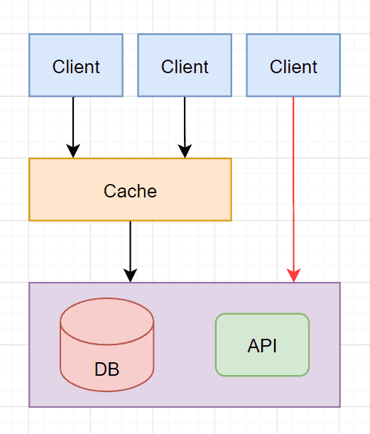
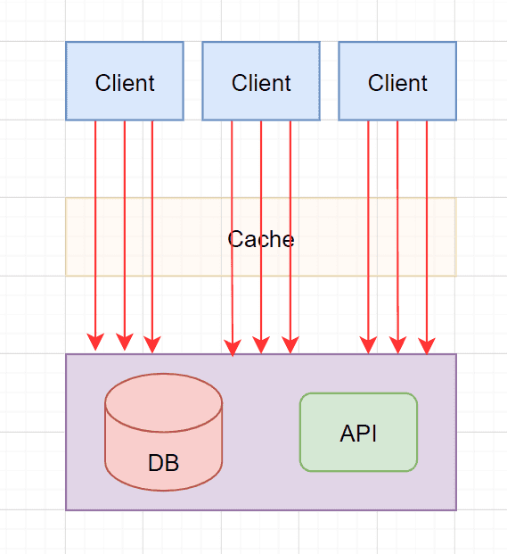

## 前言

原本是打算写并发相关的文章的，但是目前知识储备还不足，所以就先咕咕了。缓存相对简单点，就先水一篇了 ?。

## 什么是缓存？作用？

缓存（Cache）是用于数据交互的缓冲层，用于提高常用数据的读取速度，缓存非常常见，如 CPU 中的 L1 L2 L3 缓存，浏览器的静态资源缓存等。本篇主要围绕着后端缓存，硬件缓存之类的就不涉及了（我也不懂.jpg）。

缓存一般是用于在读多写少的场景下加快数据的获取，起加速作用。不过缓存其实还有另外的作用，如在高并发的场景下起到保护后端薄弱部分（数据库等）的作用。

## 一些常见的缓存算法 & 策略

### 基于访问时间

- **LRU (最近最少使用)：**通过一个缓存队列，按每项的最后被访问时间排序。当缓存满了的时候删除队尾，即最后一次被访问时间距现在最久的项。当某个项被使用的时候，则将该项移至队首。

### 基于访问频率

- **LFU (最近最少使用)：**通过一个缓存队列，按每个缓存块的被访问频率将缓存中的各块排序，当缓存满了替换掉缓存队列中访问频率最低的一项。
- **LRU-K：**是一种 LRU 算法的增强版，LRU 队列的基础上，再添加一个队列维护数据访问的次数，由原来访问 1 次会被添加到缓存中，改为访问 K 次才会被加入到缓存中。

### 基于访问时间与频率

- **ARC：**兼顾访问时间与频率，使得在数据访问模式变化时缓存策略仍有较好性能。

### 基于访问模式

有些应用有特性的数据访问特点，可以通过制定一个与之匹配的模式来实现高效缓存。

## 一些名词 & 解释

### 缓存穿透

#### 是什么？

一般情况下，我们从 API 或数据库等高耗时操作取得数据后才会对值进行缓存，如果没有获取值就不进行缓存，而这时候如果我没读取一条不存在的数据，那么该请求每次都会绕过缓存而打到缓存后的数据库或 API，这个过程就被称为缓存穿透，如下：

#### 带来的问题

当系统并发量大并且空值的查询多的时候，大部分请求会打到缓存后的薄弱部分，通常会导致数据库或 API 承受不住而导致不稳定或崩溃。

黑客可以通过这一漏洞对系统进行攻击，造成重大损失。

#### 解决方案

这一问题是不缓存空值导致的，那么我们对空值进行缓存即可解决。这种方案有一定局限性，当产生空值的范围很大的时候，这一方案就不太适用了，此时黑客可以利用不断变化查询的 key 达到爆缓存的效果。

还有一种方案是采用布隆过滤器，利用布隆过滤器来判断值是否存在，当从布隆过滤器中得知有值的时候才进入缓存和数据库，否则则直接返回不存在。通常利用这种方法来解决上述爆缓存的问题，但是布隆过滤器有误判几率，所以要依系统的特性选择合适的方案。

### 缓存击穿

#### 是什么？

缓存击穿指的是当大量请求正好请求某一个 key 的数据的时候，而这个 key 又刚好失效的时候，这些大量请求会打到数据库或 API 上，这过程就称为缓存击穿。

#### 带来的问题

会造成某个时刻数据库或 API 的压力剧增，甚至崩溃的情况发生。

#### 解决方案

如果该数据是因为时间过期导致失效，那么就应使用访问频率方式缓存。

如果该数据是因为更新而导致失效，那么可以通过加读锁使请求等待缓存更新完毕。或者使用 CAS 操作，当值更新完毕的时候就替换掉旧的缓存。

### 缓存雪崩

#### 是什么？

与缓存击穿类似，都是由于缓存失效导致的问题，不过雪崩指的就是大量的缓存失效。常见的有缓存服务器挂掉，缓存过期时间设置不当（同一时间过期）。

#### 带来的问题

在高并发的情况下，一旦出现缓存雪崩，有极大的可能会导致缓存后的服务直接崩溃。

#### 解决方案

采用集群缓存的方式，当某一条缓存服务器失效的时候还有其他缓存服务器可以顶替。

当缓存服务器失效后就对服务进行降级和限流，通过降低体验来防止后端服务挂掉导致完全不可用的状况发生。

避免设置相同的过期时间，应使缓存的数据错峰失效。

## 结语

本篇文章主要是对缓存进行介绍，其实就是一些名词解释 ?，后续可能会写一些关于 Redis 和其他缓存系统的介绍和使用，不过应该要等我肝完并发系列的文章和 PHP 框架的文章才会写吧。
