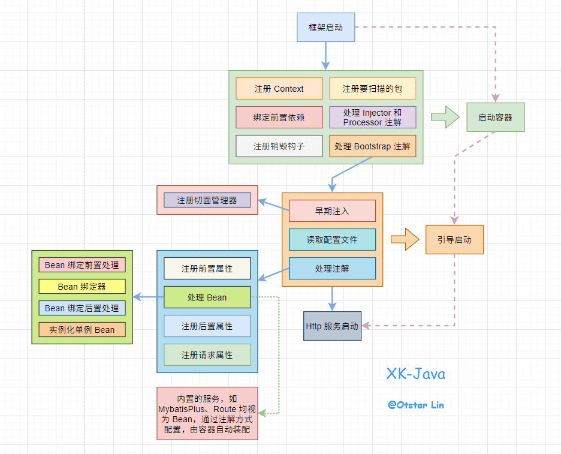

## 前言

不知不觉应该已经折腾了 8 个月的框架了，感觉已经无法在从写框架中获取有趣的知识了。于是就打算写一篇文章，算是对经验的总结。后续可能会开一个从零实现 Java 框架的文章 🤣，使劲挖坑不填坑。

学的越多，了解的越深入，就越感觉自己懂的部分原来是那么小。

## 初心

说起当初写框架的原因其实挺简单的，无非是想写一个轻量的博客系统代替现在使用的 WordPress，然后因为不想只停留在业务层，于是打算自己写个框架，然后在这个框架上写个博客系统，来以此达到学习和熟悉对应语言的目的。后来框架写着写着就逐渐忘掉了博客系统 🤣。

## 吐槽

框架，那是最有用的技术，那是最没用的技术。曾经我也因会使用某个框架为荣，因此迷失了学习的目的，同时也浪费了大量的时间。

框架，是构建在底层上的抽象层，不同的框架有不同的抽象逻辑。一旦学习过的框架凉了，那么在框架上花的时间就浪费了。当然我并不是吐槽不能学习框架，而是不应局限于学习框架的应用。当然也不能因为要学习框架的运作原理而去啃源码。通过文档去理解抽象模型才是更好的做法，也就是学习框架使用的思想等“软”技术。正如 [Stop Learning Frameworks](https://sizovs.net/2018/12/17/stop-learning-frameworks/) 这篇文章所说：

> 编程语言是不同的，但是设计是类似的。
>
> 框架是不同的，但是设计模式是类似的。
>
> 开发者是不同的，但是如何和这些人打交道是不变的。

## 设计

> **注：**以下的内容均基于 [XK-Java](https://github.com/syfxlin/xkjava)，XK-PHP 已暂时不管了 2333。

罗马不是一天建成的，写框架也一样，我们不可能一上手就设计出相对完整的框架系统，所以我们应从小的模块开始实现，如 IoC 容器，路由等，然后扩展其他模块。XK-Java 也是不断经过重构、改进才有了现在相对完善的框架。

XK-Java 早期采用的是采用写死流程的方式来启动，通过一个个 Provider 来对内置的服务进行注册和实例化，这样极其不方便，而且对扩展并不友好。并且随着注解数量的增加，为每个注解都写一个注解处理器并不是优雅的解决方案。于是参考了 Spring 的方式，通过实现组合注解，来完成注解的复用。于是你便可以看到现在 XK-Java 的注解已经累积到了 80 个，而我并不需要为这 80 个注解都编写注解处理器（逃。同时也因为组合注解，后续组件和服务解耦变得容易实现。具体前往 [README](https://github.com/syfxlin/xkjava#readme) 这里就不详细说明了，不然文章就会变得又臭又长。

XK-Java 当前的框架启动流程吧，请求流程就留到后续系列文章吧：

## 结语

写这篇文章写了一个月，因为 10 月和 11 月的一堆事情，所以没写完。今天闲的慌总算写完了，写的乱糟糟的 2333。
