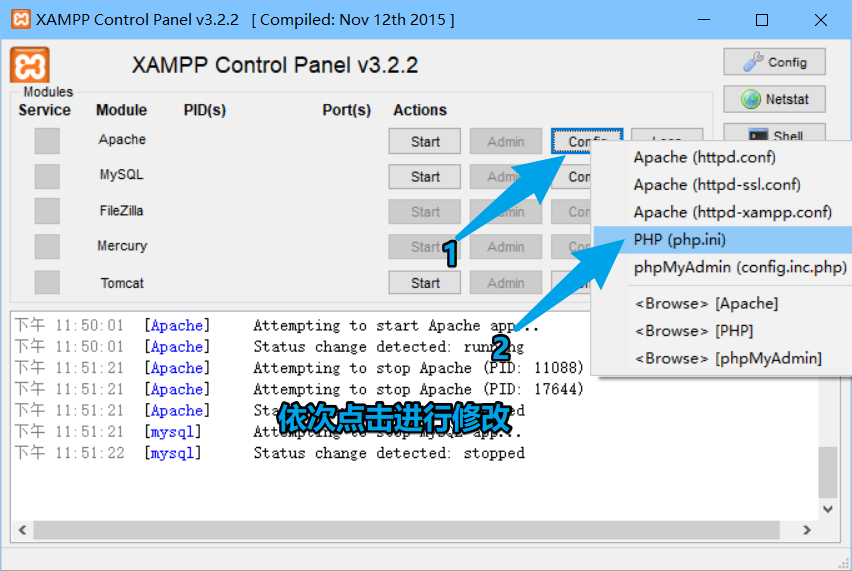
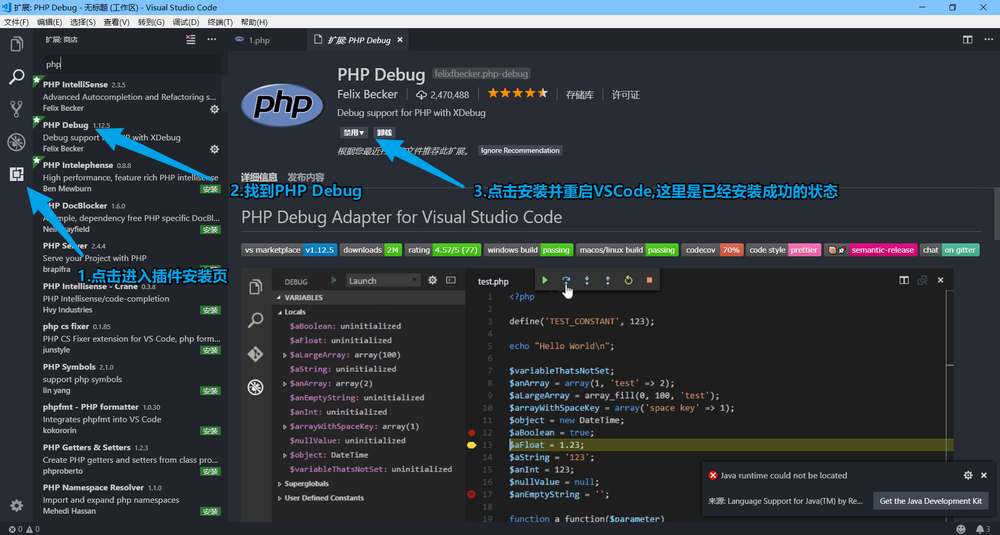
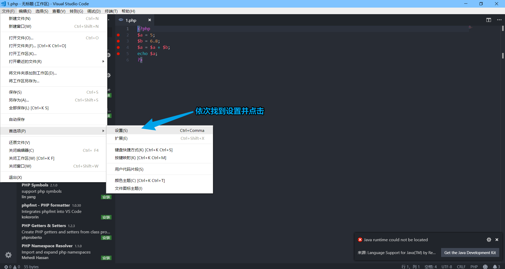
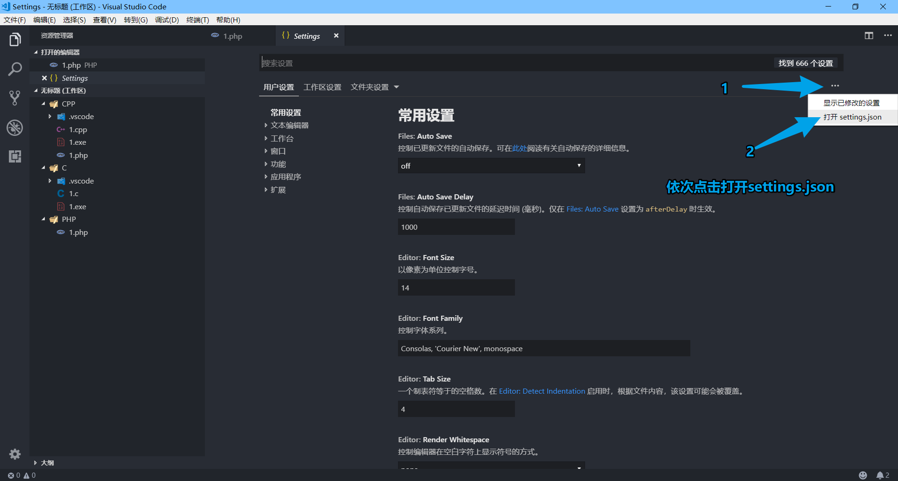
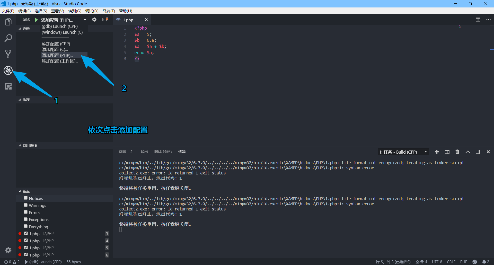
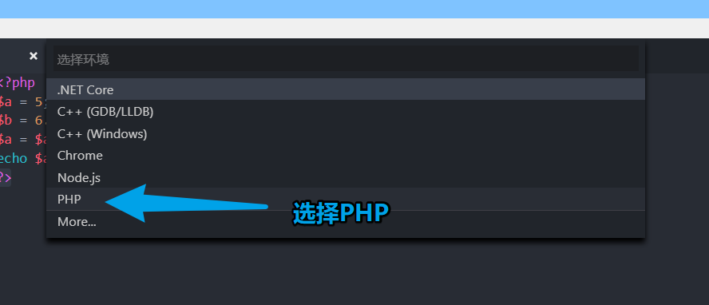
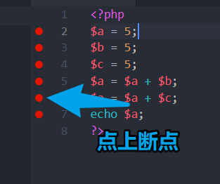
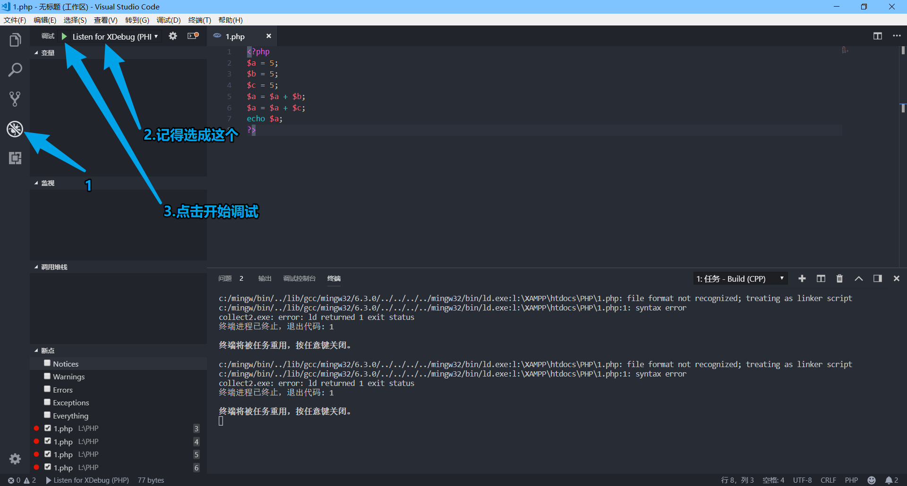
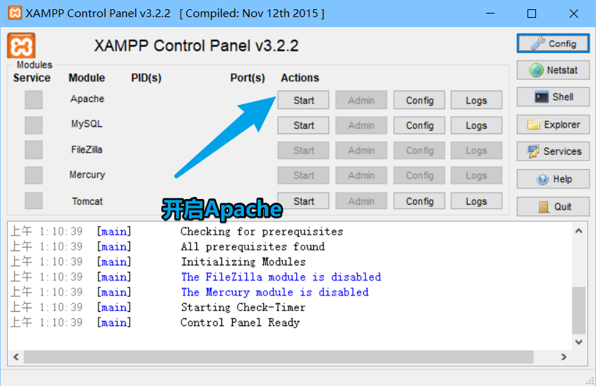

> 没有灵感,连续水一波 (逃

> 其实是我刚配好,比较健忘,以后重新配置的时候方便

# 环境准备

## XAMPP&XDebug

下载 [XAMPP](https://www.apachefriends.org/xampp-files/7.2.9/xampp-win32-7.2.9-0-VC15-installer.exe) 并安装记好安装路径,后面会用到

打开 XAMPP 开启 Apache,获取 PHP info,进入 PHP info 页面后直接全选复制,全部复制到 [XDebug 检测网址](https://xdebug.org/wizard.php) 中的输入框中,点击后网站会分析出你当前的 php 环境最适合的 xdebug 版本,并给出下载链接,下载完成后，将该文件复制到 php 的扩展目录中,即安装目录中的 ext 文件夹下

打开 XAMPP,进行配置 php.ini



编辑 php.ini,在最下方添加以下代码,路径记得更改

```undefined
[xdebug]
zend_extension = "L:\XAMPP\php\ext\php_xdebug-2.6.1-7.2-vc15.dll"
xdebug.remote_enable = 1
xdebug.remote_autostart = 1
```

## VSCode



# 配置 VSCode






找到 XAMPP 的网站文件夹,即 htdocs 文件夹,在 htdocs 下创建你的工作区(文件夹),然后在 VSCode 中打开此文件夹,然后创建一个测试用的 PHP 文件

```php
<?php
$a = 5;
$b = 5;
$c = 5;
$a = $a + $b;
$a = $a + $c;
echo $a;
?>
```

接着照着以下操作配置





#### 至此 VSCode PHP 调试环境就配置完成了,接下来就是重(坑)磅(逼)的断点调试技巧

## 断点调试

返回刚创建的 php 文件








#### 开始愉快的调试吧 (逃
