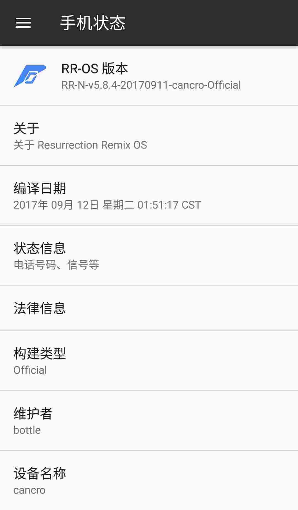
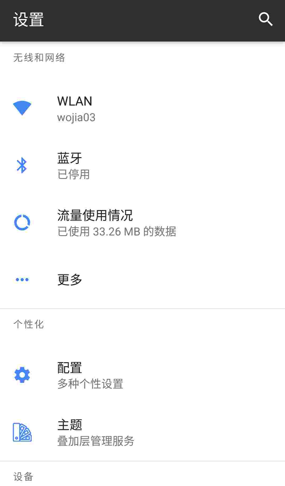
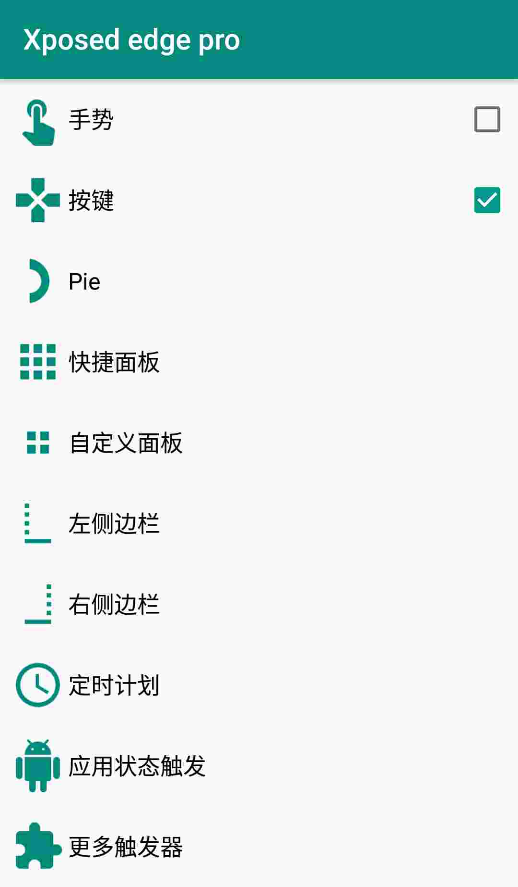

> 由于我之前用的垃圾 z90 不常用软件不闪退，常用的软件用没一分钟就闪退，实在是特别不爽，坑比的大神 note3 又因为 wifi 信号问题不能胜任常用机，好在同学收购了我的大神 note3，使得我有钱可以购入二手的小米 4(๑>؂<๑），另外我特别不喜欢使用 MIUI 系统，所以刷入 RR-OS（原本我是打算刷 win10 mobile，但考虑到软件硬伤所以还是原因安卓，等有了新的主力机后会刷入 win10）

## 刷机

手机经过漫长的等待，其实就两天(｢･ω･)｢，终于到了我的手上，经过一番验机，确认是正品，从 MIUI 论坛搞到 rec，经过不久的刷开发板，刷 rec，刷 RR-OS 后手机终于是进入了全新的世界

## 问题解决

刷入 RR-OS 后有发现一个问题任务键和主页键被映射到其他按键上，由于是二手机，我并不知道手机是否换过屏幕所以无法知道是否是硬件问题，但是 7.1 已经有了 xposed，既然有了 xposed 那还怕什么，改改改。。。

使用 xposed edge 插件成功改键

## 使用体验

系统没有什么大毛病，就是发热严重，另外 cpu 调度有点坑，没开游戏系统动态开核，一开游戏立马锁两核 →_→，不知是 ppsspp 的问题还是系统问题（我只测试过 ppsspp，之后会测试一些耗性能的游戏）

待机无敌，经过两天的测试待机基本不会掉电，使用时掉电也不快，连续重度使用两小时掉 35%电量

充电方面没有测试，因为我没有 6pin 数据线，没法测试 9v 快充性能，但是 5v 2a 充电速度还不错，20 分钟冲 20%电

## 总结

如果是想要稳定使用的话还是 MIUI9 会比较好用，但是如果你是一个像我一样没有 xposed，没有原生系统，不能个性定义系统就不能好好使用手机的人，那么 RR-OS 非常适合你，RR 有非常多的自定义选项可以自己打造系统界面，优化使用体验。
